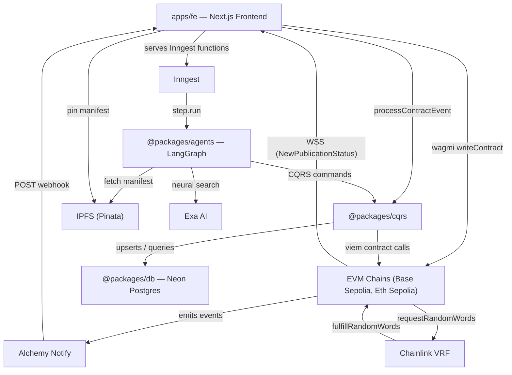
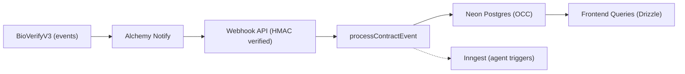
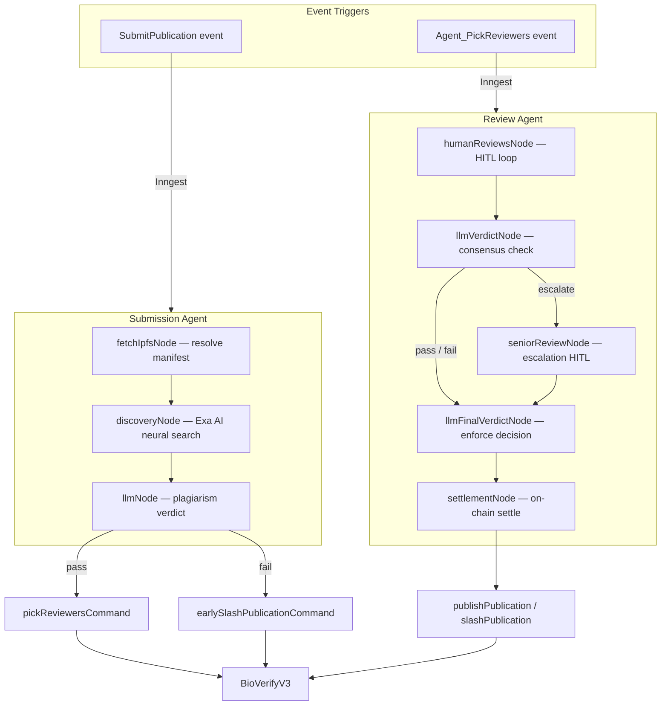
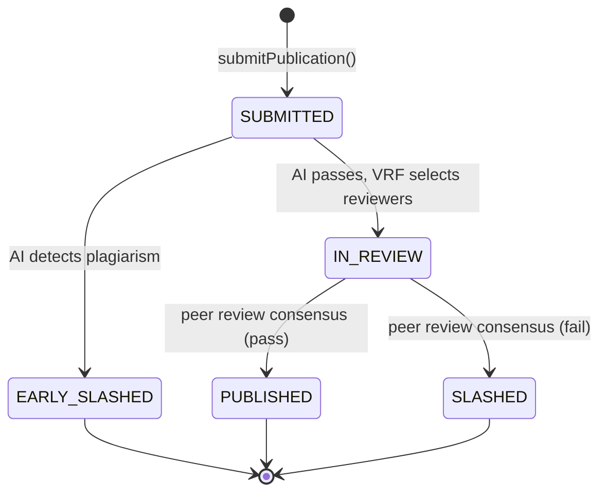

[](https://bio-verify-ai-dapp.vercel.app)


# 🧬 BioVerify Protocol — Technical Specification & Reference Implementation

## TL;DR

BioVerify is a fully event-driven Web3 protocol that replaces traditional backend orchestration with:

- **On-chain events as the source of truth**
- **Off-chain CQRS projection for real-time UX**
- **Durable workflows (Inngest + LangGraph)** for async coordination

It demonstrates how to build **deterministic Web3 systems** without polling, cron jobs, or centralized orchestration.

**Core pattern:** Event Sourcing + CQRS + Durable Execution.


## 🚀 What This Project Demonstrates

What the system achieves end-to-end:

- **Smart contracts:** secure, gas-efficient state transitions using CEI, pull payments, and VRF-based randomness (Chainlink)
- **Security posture:** reentrancy containment (`nonReentrant`), EIP-712 for human intent, HMAC-authenticated webhook ingress
- **Quality bar:** Foundry suite at 100% branch coverage, including fuzzing, VRF mocks, and explicit revert-path tests
- **Backend:** CQRS with a Neon Postgres projection instead of heavy RPC read paths
- **Infrastructure:** durable, retry-safe execution via Inngest (no cron-as-orchestrator)
- **Frontend:** real-time Next.js UI driven by WebSockets and projection-backed queries (no polling)

Net effect: verifiable state transitions and predictable behaviour under async workloads.

## 🧠 Abstract

**[Live demo](https://bio-verify-agentic-dapp.vercel.app)** — BioVerify is a **end to end** Web3 system for **multi-actor workflows** (staking, screening, VRF-based reviewer draw, signed reviews, settlement) on **Base Sepolia** and **Ethereum Sepolia**.

Writes stay on-chain; reads for the app come from a **Neon Postgres** projection fed by verified Alchemy webhooks. **Inngest** runs long-running steps; **LangGraph** coordinates orchestration only — the protocol does not treat LLM output as authoritative state.

Details follow in the sections below.

## 🧭 User Flow (End-to-End)

1. **Submit** a publication with stake (manifest pinned to IPFS; CID committed on-chain).
2. **Screen:** submission pipeline runs plagiarism / originality checks (structured verdicts).
3. **If valid →** Chainlink VRF selects reviewers from the staked pool.
4. **Review:** reviewers submit signed verdicts (**EIP-712**); conflicts can escalate.
5. **Resolve:** a controlled (**whitelisted**) agent advances consensus (or escalation path) off-chain, then **settles on-chain**.
6. **Settle:** contract publishes or slashes; stakes and incentives follow terminal rules.

Each hop is verifiable: chain events, typed signatures, and the projection trail.

## 💡 Engineering Highlights

How the stack is split:

### Smart Contract ↔ Frontend Synchronization

- Mutations emit events; the UI reads from the Postgres projection (not direct struct getters on the contract)
- WebSocket subscriptions keep lists and detail views fresh without polling loops

### Asynchronous Backend Orchestration

- Chain events → authenticated webhooks → CQRS projector / Inngest triggers
- Inngest provides retries and step isolation for commands that must survive days-long human steps

### Agent-Orchestrated Workflows (Deterministic Execution)

Deterministic workflows orchestrated via **LangGraph**, where:

- LLM outputs are **schema-constrained** before they become commands
- **State transitions are validated** before execution (CQRS commands, contract gates)
- The **blockchain remains the source of truth**; agents orchestrate, they do not replace consensus

### On-Chain Economic Logic

- Staking / slashing mechanisms
- Verifiable randomness (Chainlink VRF)
- Multi-actor coordination with incentives

### Complex UX for Web3

- Wallet interaction (EIP-712 signing, transactions)
- Live row/detail updates via subscriptions (see Performance for read-path costs)
- Multi-role flows (submitter, reviewer, validator)

### Performance & Cost Optimization

- **Gas-aware design:** minimal on-chain storage; reads for product queries hit the projection, not heavy `eth_call` fanout
- **WebSockets** replace polling loops for live UI
- **Projection-backed reads** avoid expensive on-chain queries for list/detail state
- **Lean contract surface:** getter-less design reduces bytecode size and gas costs
- **Pull payments:** avoids gas-limit failures in multi-recipient payouts

### Security & Testing Discipline

- **Checks–Effects–Interactions (CEI)** pattern and OpenZeppelin `nonReentrant` on ETH-out paths (`claim`, `transferSlashPoolToTreasury`)
- **EIP-712** asymmetric signing (ECDSA / secp256k1) for human reviews + **HMAC-SHA256** symmetric authentication for Alchemy webhooks (integrity + authenticity)
- **Foundry** suite with **100% branch coverage** (`forge test`, `forge coverage`)

### Security Model Summary

- **Reentrancy mitigation:** CEI pattern + `nonReentrant` guards
- **DoS resistance — pull-based withdrawals:** A naive settlement that **pushes** ETH to every reviewer in one transaction grows linearly with headcount and can exceed the block **gas limit**, enabling a **gas-limit DoS** on settlement (honest runs fail; griefers cheaply force oversized payout loops). BioVerify credits rewards on-chain but routes payouts through **`claim`** so each recipient **pays their own gas** to withdraw. That shifts the claiming burden off the protocol’s settlement path: settlement stays bounded, and throughput does not degrade as more reviewers participate.
- **Access control:** agent-restricted state transitions
- **Data integrity:** HMAC-SHA256 verification for webhooks
- **User authenticity:** EIP-712 typed signatures (ECDSA)

The system minimizes trusted surface area and ensures external inputs are authenticated before state mutation.

## 🧩 Full Stack Ownership

This system was designed and built end-to-end:

- **Smart contracts:** Solidity (Foundry, Chainlink VRF, OpenZeppelin)
- **Backend:** Node.js / TypeScript (event ingestion, CQRS projection, Inngest workflows)
- **Frontend:** Next.js 16 (React 19, real-time UI, wallet integration via wagmi/viem)
- **Infrastructure:** Alchemy Notify, Neon Postgres, Vercel Functions

The architecture deliberately separates:

- **Write path:** blockchain transactions
- **Read path:** off-chain projection (CQRS)
- **Execution:** durable agents (Inngest + LangGraph)

## Smart Contract Architecture & Security

The protocol contract is [`apps/contracts/src/BioVerifyV3.sol`](apps/contracts/src/BioVerifyV3.sol): staking, Chainlink VRF v2.5 reviewer selection, agent-gated settlement, and pull-based withdrawals.

### Checks–Effects–Interactions (CEI) & Reentrancy

- **CEI** is applied on ETH-out paths: internal accounting, status, and events are updated **before** external calls (e.g. `claim`, `transferSlashPoolToTreasury`), limiting reentrancy risk by construction.
- **`nonReentrant`** (OpenZeppelin) guards **`claim`** and **`transferSlashPoolToTreasury`**; other flows rely on ordering and minimal external sends.

### Pull Payments & Gas / DoS Considerations

- **`claim(uint256)`** implements a **pull-withdrawal** model for **`availableStake`**. Settlement does not push ETH to arbitrary recipients in bulk, avoiding classic **gas-limit DoS** vectors on multi-party payouts.

### Access Control & Minimal On-Chain Surface

- **Agent-only execution model:** critical state transitions are not user-triggered but executed by a **controlled (whitelisted) agent**, reducing the attack surface and enforcing deterministic workflow progression.
- **Agent-only** functions (`pickReviewers`, `earlySlashPublication`, `publishPublication`, `slashPublication`, `recordReview`, …) are restricted to an immutable **`I_AI_AGENT_ADDRESS`**, shrinking the trusted transition surface.
- **Getter-less design:** no view getters on rich structs; mutations emit **indexed events**, reducing bytecode size and encouraging off-chain projections — **gas-efficient** writes and a smaller audit surface.

### State Machine & Settlement Invariants

- Modifiers such as **`onlyValidPubId`** and publication status checks enforce valid **`PublicationStatus`** transitions.
- **`_settlePublication`** requires **`honest.length + negligent.length == I_VRF_NUM_WORDS`** before distributing rewards and slashing negligent reviewers.

### EIP-712 & Asymmetric Cryptography (Off-Chain Reviews)

Human peer reviews are signed with **EIP-712 typed structured data** — **asymmetric-key cryptography** (ECDSA over secp256k1). The stack verifies payloads server-side with viem **`verifyTypedData`** (see [`packages/utils-server/crypto/eip712/verify-review-eip712.ts`](packages/utils-server/crypto/eip712/verify-review-eip712.ts)), binding reviewer identity to the review without an on-chain signature transaction.

## Testing & Quality Assurance

Foundry tests live under [`apps/contracts/test/`](apps/contracts/test/) (12 scenario files: deployment, pay stake, submit, early slash, pick reviewers / VRF fulfillment, record review, publish / slash, claim, pools).

- **Named paths:** `test_*_Success` and `test_RevertIf_*` with **`vm.expectRevert(abi.encodeWithSelector(...))`** for precise failure modes.
- **Event discipline:** helpers assert emissions with **`vm.expectEmit`** across state transitions.
- **VRF:** mock coordinator, **`fulfillRandomWordsWithOverride`**, and **`vm.recordLogs` / `vm.getRecordedLogs`** to validate reviewer selection under edge cases (e.g. colliding random words in [`07_FullfillVRF.t.sol`](apps/contracts/test/07_FullfillVRF.t.sol)).
- **Transfer failures:** **`ETHRejector`** contract tests revert paths for **`claim`** and treasury transfers.
- **Fuzzing:** e.g. **`testFuzz_SubmitPublication`** with **`bound`** and post-condition checks on balances.
- **Coverage:** **`pnpm contract:cov`** → **`forge coverage`**; README / CI target **100% branch coverage**.

## 🏗️ Architecture Snapshot

**Key idea:** the blockchain emits events → everything else reacts.

- Contracts emit events only (no getters)
- Events are indexed into Postgres (CQRS)
- The frontend subscribes via WebSockets
- Backend workflows are triggered via webhooks
- Agents process data asynchronously and feed results back on-chain

## Architecture

### System Overview

How the monorepo packages connect to each other and to external services.



### Event-Driven Data Flow

The contract uses a getter-less design: all state mutations emit events. These are projected off-chain into a Postgres read model, which powers all frontend queries — no `eth_call` read traffic for app state. In parallel, the frontend subscribes to `NewPublicationStatus` via standalone viem WebSocket clients (Alchemy WSS), independent of wallet connection state, with debounced TanStack Query invalidation so the publications list and stats stay fresh **without polling**.

**Webhook authenticity:** Alchemy Notify POSTs are verified with **HMAC** using a **shared secret** and **SHA-256** — **symmetric-key cryptography**. Only payloads bearing a valid MAC are accepted, giving **data integrity** and **authenticity** before `processContractEvent` runs.

**Human review authenticity:** Reviewers sign structured payloads with **EIP-712** — **asymmetric-key cryptography** (ECDSA / secp256k1) — so the agent pipeline can prove which wallet approved a given verdict off-chain.



### Why a Custom Projector?

Off-the-shelf stacks (e.g., The Graph, Ponder) were evaluated but replaced because:

- **Scope mismatch:** BioVerify needs contract-specific projection, not full-chain indexing
- **Cost constraints:** free-tier limits restrict large-scale indexing
- **Control:** a custom projector enables deterministic handling of out-of-order events

The implemented solution uses:

- **Alchemy Notify** → webhook ingestion
- **HMAC verification** → authenticity
- **OCC** (block number + log index) → consistency under real-world delivery

### Agent Orchestration & Durability

Logic state and execution durability are separated to handle the asynchronous nature of human review:

- **LangGraph** manages the agent lifecycle using checkpointers. This allows the workflow to pause for days during peer review and resume exactly where it left off.
- **Inngest** provides the durable execution layer — automatic retries for on-chain commands, wait-for-event logic, and fan-out orchestration.



### Failure Handling & Idempotency

- **Idempotent event processing:** OCC (block number + log index) prevents stale writes when webhooks arrive out of order or twice.
- **Retry-safe workflows:** Inngest isolates steps so failed steps can be replayed without duplicating side effects when steps are designed idempotently.
- **Deterministic projections:** replaying events yields the same read model.

Correctness holds under webhook retries, out-of-order delivery, and partial failures.

### Publication Lifecycle

The `PublicationStatus` state machine on-chain.



### Terminal Outcomes

| Outcome | Trigger Phase | Publisher Impact | Reviewer Impact |
|:--------|:--------------|:-----------------|:----------------|
| **Early Slashed** | Pre-Review (Immediate) | Slashed: stake moved to slash pool; reputation penalty. | None: no reviewers selected; no rewards distributed. |
| **Published** | Post-Review (Success) | Rewarded: stake returned; reputation boost. | Split: honest get stake + reward + rep; negligent lose stake + rep. |
| **Slashed** | Post-Review (Failure) | Slashed: stake moved to slash pool; reputation penalty. | Split: honest get stake + reward + rep; negligent lose stake + rep. |

For detailed end-to-end sequence diagrams with every interaction, see [`docs/architecture.md`](docs/architecture.md).

## 🧩 Why This Matters

Typical dApp pain: **polling** (`eth_call`), **cron-shaped glue**, and **UI drift** from chain truth.

BioVerify instead couples **chain truth → webhook → projection → UI**, with **durable jobs** for anything that takes longer than a block:

- **Reads:** served from a maintained projection for the product UX needs (and avoid RPC spam)
- **Automation:** chain-triggered steps with retries—not ad hoc cron
- **Replay:** idempotent projector + isolated workflow steps for sane recovery

Horizontal scale: add contracts or chains by extending **ingestion + projection**, not rewriting core protocol rules.

Same patterns transfer to DeFi dashboards, DAO tooling, marketplaces—anywhere multiple actors coordinate over time.

## 🧬 Domain Use Case

This implementation applies the architecture to a **peer-review workflow** (stake to submit, AI screening, VRF-selected reviewers, human verdicts, settlement). The system is **domain-agnostic** and can be adapted to any multi-step, multi-actor process that needs coordination, validation, and incentives.

## Monorepo Structure

pnpm workspaces with two apps and seven packages.

```
apps/
  contracts/          BioVerifyV3 Solidity contract (Foundry) — staking, VRF, settlement
  fe/                 Next.js 16 frontend — DApp UI, webhook API, Inngest serving, WSS event subscriptions

packages/
  agents/             LangGraph AI agents (submission + review)
  cqrs/               Event projector, DB queries, on-chain action commands
  db/                 Drizzle ORM client (Neon Postgres)
  env/                Type-safe environment variable access (Zod)
  notifications/      Telegram notification helpers
  schema/             Zod schemas, DB table definitions, domain types, Inngest event types
  utils/              Contract config, ABI, network mappings, EIP-712 type definitions
  utils-server/       Server-only utilities
```

## Tech Stack

| Layer | Technologies |
|-------|-------------|
| Smart Contracts | Solidity, Foundry, OpenZeppelin, Chainlink VRF V2.5 |
| Frontend | Next.js 16 (App Router, RSC), React 19, TypeScript, Tailwind CSS v4, shadcn/ui |
| Web3 | wagmi v3, viem, Reown AppKit (WalletConnect), EIP-712 typed data signing |
| AI Agents | LangGraph.js, Gemini (structured output), Exa AI (neural search) |
| Data | Drizzle ORM, Neon Postgres (serverless), TanStack Query v5, nuqs (URL state) |
| Storage | IPFS via Pinata (publication manifests, verdict pinning) |
| Infrastructure | Inngest (durable execution), Alchemy Notify (webhooks), Vercel Functions |
| Security | CEI pattern, OZ ReentrancyGuard, EIP-712 (ECDSA), HMAC-SHA256 webhook auth |
| Testing | Foundry (`forge test`, `forge coverage`), VRF mock, fuzz tests |
| Quality | Biome (lint + format) |

## Features in Action

The clips below follow the publication lifecycle from submission through human-in-the-loop review, then a separate plagiarism scenario, reviewer staking, and finally how on-chain events trigger durable agent runs in Inngest.

### Submitting a publication (success path)

*Split view: BioVerify Telegram bot (left) and DApp (right).*

The author completes the publication form (metadata and IPFS manifest) and prepares to submit.


The author confirms the on-chain transaction. The bot receives status notifications as the publication moves from **SUBMITTED** to **IN REVIEW**; the author lands back on the publications list.


Opening the publication detail page shows **IN REVIEW** and the Chainlink VRF–selected reviewers.


### Peer review — human-in-the-loop conflict resolution

*Same publication as above, now in the review phase.*

The first peer reviewer submits a **pass** verdict and validates the submission.


The second peer reviewer submits a **fail** verdict. The two peer reviews now **conflict**.


*Split view: Telegram bot (left) and senior reviewer (right).* The bot shows both peer reviews and the agent’s decision to **escalate** to the senior reviewer. The senior reviewer opens the Reviewer Portal and prepares a tie-breaking **pass**.


After the senior review is submitted, Telegram reflects **PUBLISHED**; the detail page shows the final verdict from IPFS and **PUBLISHED** status.


### AI plagiarism detection and early slashing

*Separate scenario: a submission that duplicates work already present in the scientific literature.*

*Dual device view: User A (mobile, no wallet) on `/publications` (left); User B (tablet, wallet on Base Sepolia) (right).*

User B submits the publication on-chain.


User A sees the row appear in real time over **WebSocket** (no wallet required). User B opens the detail page, follows the live **Validation Trail**, and ends on **EARLY SLASHED** with the AI verdict loaded from IPFS.


### Reviewer portal — stake, top-up, claim

A visitor who is not yet in the reviewer pool opens the Reviewer Portal, joins for the **currently connected network** (Base Sepolia or Ethereum Sepolia), pays the **reviewer stake**, and after the transaction the UI refreshes to show **available stake** (claimable or eligible for future VRF selection if above the minimum).


A reviewer already assigned to one cycle (locked stake equals reviewer stake) **tops up** so they can be picked again; the new available balance is shown.


With **available stake > 0**, the reviewer **claims** up to that amount (pull withdrawal).


### Under the hood — agent orchestration (Inngest)

Production Inngest runs driven by Alchemy Notify webhooks → Next.js API [`apps/fe/app/api/webhooks/alchemy/all-events/route.ts`](apps/fe/app/api/webhooks/alchemy/all-events/route.ts) → CQRS [`processContractEvent`](packages/cqrs/src/commands/sync/events.ts).

Completed **`submission-agent`** run after a `CHAIN_SUBMISSION_RECEIVED` event (from `SubmitPublication` in [`events.ts` lines 158–185](packages/cqrs/src/commands/sync/events.ts)):


Completed **`review-agent`** run after a `CHAIN_PICKED_REVIEWERS_RECEIVED` event (from `Agent_PickReviewers` in [`events.ts` lines 205–229](packages/cqrs/src/commands/sync/events.ts)):


## 🧪 Quick Start

1. **Try the demo:** [Live Demo](https://bio-verify-agentic-dapp.vercel.app)
2. **Get Testnet Sepolia ETH:** [Sepolia Faucet](https://sepolia-faucet.pk910.de/)
3. **Swap for Base Sepolia ETH:** [Superbridge](https://superbridge.app/base-sepolia) (only if you want to use Base)
4. **Connect your wallet** to the DApp (Base Sepolia or Ethereum Sepolia)
5. **Submit a publication** and/or **register as a reviewer** and let the agents handle the rest

## Getting Started

### Prerequisites

- Node.js 20+
- pnpm 10+
- [Foundry](https://book.getfoundry.sh/) (for contract development)

### Setup

```shell
git clone https://github.com/SiegfriedBz/BioVerify_Agentic_DApp.git
cd BioVerify_Agentic_DApp
pnpm install
cp .env.example .env   # fill in your keys (see packages/env for validation)
```

### Scripts

All scripts run from the monorepo root.

**Frontend**

```shell
pnpm fe:dev                    # start Next.js dev server
pnpm fe:build                  # production build
pnpm fe:start                  # start production server
```

**Contracts**

```shell
pnpm contract:compile          # forge compile
pnpm contract:test             # forge test
pnpm contract:cov              # forge coverage
pnpm contract:deploy:base      # deploy to Base Sepolia + sync config
pnpm contract:deploy:sepolia   # deploy to Ethereum Sepolia + sync config
pnpm contract:sync-config      # regenerate TS config from Foundry artifacts
```

**Database**

```shell
pnpm db:push                   # push Drizzle schema to Neon
pnpm db:seed                   # seed protocol config rows
pnpm db:setup-agents           # initialize LangGraph checkpointer tables
```

**Infrastructure**

```shell
pnpm inngest:dev               # local Inngest dev server
pnpm inngest:sync              # sync Inngest functions to cloud
```

**Quality**

```shell
pnpm lint:check                # Biome lint
pnpm lint:format               # Biome format
```

## Deployment

| Network | Contract Address |
|:--------|:-----------------|
| **[Base Sepolia](https://sepolia.basescan.org/address/0x76654c2cdadcf869e78928f0785797b6be20f11b)** | `0x76654c2cdadcf869e78928f0785797b6be20f11b` |
| **[Ethereum Sepolia](https://sepolia.etherscan.io/address/0x7d52170db31be4ab3d0166fbba937a031dc6e1ff)** | `0x7d52170db31be4ab3d0166fbba937a031dc6e1ff` |

## Design Decisions & Roadmap

### Current Design Choices

- **Automated Slashing** — The AI agent slashes stakes immediately when plagiarism is detected, prioritizing protocol efficiency over manual appeals.
- **Senior Reviewer Tie-Break** — When peer reviewers disagree, the highest-reputation reviewer is escalated via a second HITL interrupt to cast the deciding verdict, rather than requiring a full quorum re-vote.
- **Getter-Less Contract** — BioVerifyV3 emits events for every state mutation and exposes no view functions. All reads are served from the off-chain Postgres projection, keeping gas costs minimal and the contract attack surface small.

### Roadmap

**Weighted Majority Voting** — Replace the Senior Reviewer tie-breaker with a decentralized consensus mechanism where reviewer votes are weighted by on-chain reputation score.

**Reputation via ZK-Proofs (Reclaim Protocol) & Sybil resistance** — Reviewer reputation is currently bootstrapped from on-chain history alone. Integration with [Reclaim Protocol](https://www.reclaimprotocol.org/) would let reviewers attach **verifiable, privacy-preserving** proofs of real-world standing (e.g. h-index, affiliation) without doxxing raw credentials—supporting the goal that **one durable human identity maps to one reviewer seat** without exposing unnecessary PII. That directly attacks **identity Sybil** (many fake reviewers) and raises the cost of **reviewer collusion rings** in decentralized governance: roles become harder to farm at scale while integrity of the selection game improves.

**Paid Content Access (x402)** — Integration of the [x402 protocol](https://www.x402.org/) to gate publication content behind micropayments. Non-publishers and non-reviewers would pay to access full research data (datasets, methodology, supplementary materials) through x402's HTTP 402-based payment flow, creating a sustainable revenue stream for honest publishers.

**Encrypted Access Control (Lit Protocol)** — Publication data on IPFS would be encrypted using [Lit Protocol](https://litprotocol.com/). Decryption keys are only released when on-chain conditions are met — "has paid via x402", "is an assigned reviewer", or "is the publisher" — combining payment verification with decentralized key management and removing the need for a centralized access server.

**Internal corpus + RAG (directional)** — Today screening leans on **Exa** for external literature; niche or brand-new protocol content may not appear there in time. Roadmap: embed **published** manifests into **Neon + pgvector** (triggered when status hits `PUBLISHED`), run **internal similarity** alongside Exa, and tighten originality checks for work already inside the protocol. Crawlable manifests and a BioVerify-only search UI would follow if the corpus grows.

## License

MIT — Siegfried Bozza, 2026

## 👤 Author

**Siegfried Bozza** — Full-stack on & Web3 builder (Solidity / Node.js / React)

Built BioVerify end-to-end: protocol design, smart contracts, backend architecture, and frontend.

**Focus areas:** event-driven Web3 systems · protocol security · distributed architecture

[LinkedIn](https://www.linkedin.com/in/siegfriedbozza/) · [GitHub](https://github.com/SiegfriedBz)
