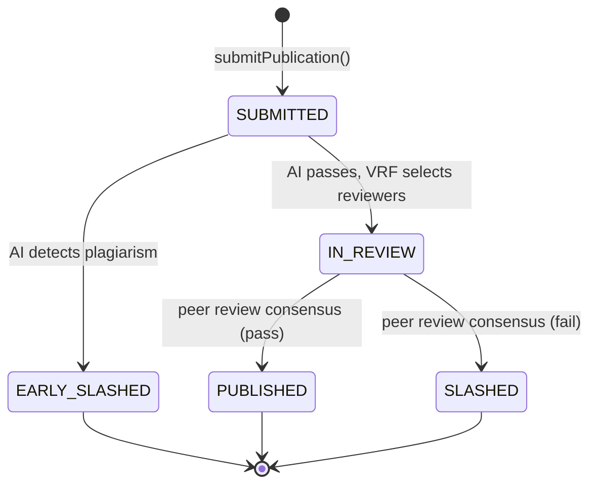
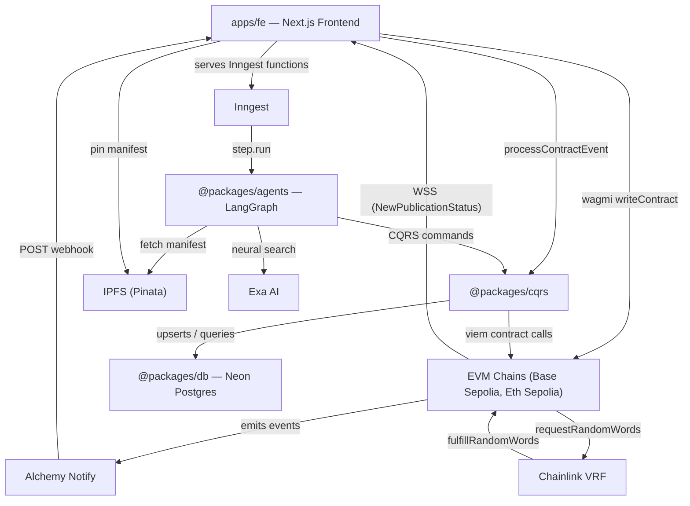
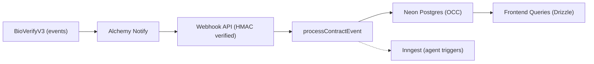
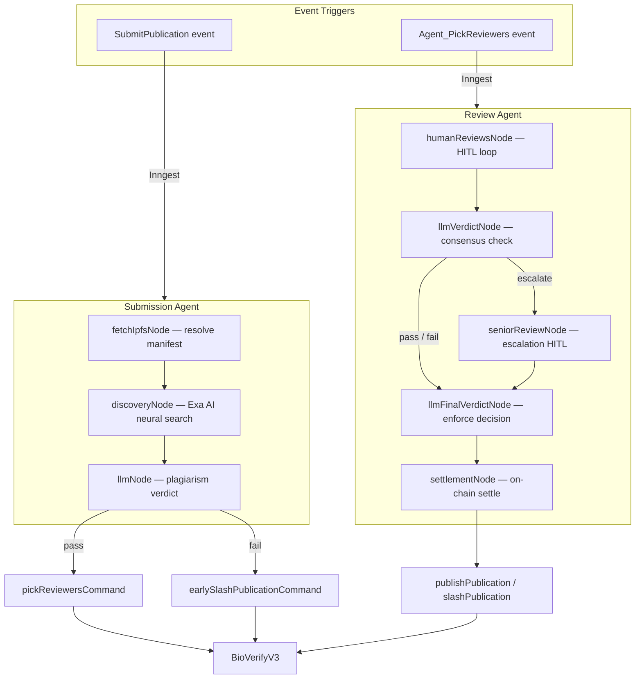

# 🧬 BioVerify Protocol

A Web3 peer-review system on Base Sepolia and Ethereum Sepolia. Authors stake ETH to submit publications, then two agents drive the process:

1. **Screening agent** — checks the submission against scientific literature (Exa AI). If plagiarism is detected, it triggers an early slash on-chain. If the submission passes, it requests a random reviewer pool via Chainlink VRF.
2. **Review agent** — runs the human peer review cycle (HITL). If peer reviewers conflict, a senior reviewer breaks the tie. The final verdict triggers either a slash or a publication on-chain.

Publication manifests are pinned to IPFS at submission time and verdict data is pinned at settlement. This protects against link rot and prevents anyone from silently modifying a publication's content after the fact — the on-chain CID is the commitment.

---

## Quick Start

1. Open the **[live demo](https://bio-verify-ai-dapp.vercel.app)**
2. Connect a wallet (Base Sepolia or Ethereum Sepolia)
3. Submit a publication or register as a reviewer — the agents handle the rest

Need testnet ETH? [Sepolia Faucet](https://sepolia-faucet.pk910.de/) · [Superbridge to Base](https://superbridge.app/base-sepolia)

---

## Why

Traditional scientific publishing has two structural problems. First, the economic rewards flow to publishers (Elsevier and others) rather than to the researchers and reviewers who do the actual work. Second, peer review as currently practiced contributes to the reproducibility crisis: reviewer selection is opaque, verdicts are unchallengeable, and reviewer incentives are too weak to ensure rigorous scrutiny.

BioVerify treats peer review as a coordination problem — multiple actors (authors, reviewers, AI agents) need to reach a verifiable outcome, with economic incentives keeping everyone honest. Stakes, verdicts, and settlements live on-chain. Rewards go to reviewers, not intermediaries.

Two layers make this work:
- **Blockchain** — the trust layer. Stakes, verdicts, and settlements are on-chain. No one can fake an outcome.
- **LangGraph agents** — the orchestration layer. They drive the workflow (screen → pick reviewers → collect verdicts → settle) without becoming the source of truth.

---

## Solution

**Chain events drive everything.** The contract emits events instead of exposing view functions. Those events feed a Postgres projection (CQRS), which the frontend reads. Long-running steps run through Inngest for retry-safe execution. Agents orchestrate — they don't replace the contract as source of truth.

### Publication lifecycle



### Terminal outcomes

| Outcome | Publisher | Reviewers |
|:--------|:----------|:----------|
| **Early Slashed** | Stake slashed, reputation penalty | None selected |
| **Published** | Stake returned, reputation boost | Honest: stake + reward + rep · Negligent: stake slashed + rep penalty |
| **Slashed** | Stake slashed, reputation penalty | Honest: stake + reward + rep · Negligent: stake slashed + rep penalty |

---

## Architecture

### System overview



### Event-driven data flow

Contract mutations emit events → Alchemy Notify POSTs a webhook (HMAC-SHA256 verified) → `processContractEvent` upserts the Postgres projection → frontend queries hit Postgres, not the chain. A separate viem WebSocket client subscribes to `NewPublicationStatus` events and invalidates TanStack Query cache, so the UI stays current without polling.



### Agent orchestration



LangGraph manages agent state with checkpointers so a workflow can pause for days during human review and resume exactly where it left off. Inngest handles retries and step isolation so failed steps replay without duplicating side effects.

### Smart contract notes

- **CEI + nonReentrant** on ETH-out paths (`claim`, `transferSlashPoolToTreasury`)
- **Pull payments** — settlement credits rewards on-chain; each reviewer calls `claim` and pays their own gas. This keeps settlement gas bounded regardless of reviewer count.
- **Agent-gated transitions** — critical state changes go through a whitelisted agent address, not arbitrary users
- **Getter-less design** — no view functions on structs; all state is projected off-chain from events
- **EIP-712** — reviewer verdicts are signed off-chain (ECDSA/secp256k1) and verified server-side with viem

### Idempotency & consistency

Webhook ingestion uses optimistic concurrency on `(blockNumber, logIndex)` to prevent stale or duplicate writes. Replaying events produces the same read model. The projection is eventually consistent relative to chain tip; deeper finality guarantees (confirmation gates, rewind/replay) are the obvious next step if stronger safety is needed.

---

## Tech Stack

| Layer | Technologies |
|-------|-------------|
| Smart Contracts | Solidity, Foundry, OpenZeppelin, Chainlink VRF V2.5 |
| Frontend | Next.js 16 (App Router, RSC), React 19, TypeScript, Tailwind CSS v4, shadcn/ui |
| Web3 | wagmi v3, viem, Reown AppKit (WalletConnect), EIP-712 |
| AI Agents | LangGraph.js, Gemini (structured output), Exa AI (neural search) |
| Data | Drizzle ORM, Neon Postgres, TanStack Query v5, nuqs |
| Storage | IPFS via Pinata |
| Infrastructure | Inngest, Alchemy Notify, Vercel Functions |
| Security | CEI, OZ ReentrancyGuard, EIP-712 (ECDSA), HMAC-SHA256 |
| Testing | Foundry (`forge test`, `forge coverage`), VRF mock, fuzz tests |

---

## Features in Action

### Submitting a publication (success path)

*Split view: BioVerify Telegram bot (left) and DApp (right).*

The author fills in the publication form (metadata and IPFS manifest) and prepares to submit.


The author confirms the on-chain transaction. The bot receives status notifications as the publication moves from **SUBMITTED** to **IN REVIEW**.


The publication detail page shows **IN REVIEW** and the Chainlink VRF–selected reviewers.


### Peer review — human-in-the-loop conflict resolution

The first peer reviewer submits a **pass** verdict.


The second peer reviewer submits a **fail** verdict. The two reviews now conflict.


*Split view: Telegram bot (left) and senior reviewer (right).* The bot shows both peer reviews and the agent's decision to escalate. The senior reviewer submits a tie-breaking **pass**.


After the senior review, Telegram reflects **PUBLISHED** and the detail page shows the final verdict from IPFS.


### AI plagiarism detection and early slashing

*Dual device view: User A (mobile, no wallet) on `/publications` (left); User B (tablet, wallet on Base Sepolia) (right).*

User B submits a publication that duplicates existing literature.


User A sees the row appear in real time over WebSocket (no wallet needed). The publication ends at **EARLY SLASHED** with the AI verdict loaded from IPFS.


### Reviewer portal — stake, top-up, claim

A new reviewer joins the pool and pays the reviewer stake.


An existing reviewer tops up so they can be picked in another cycle.


A reviewer claims their available balance (pull withdrawal).


### Agent orchestration (Inngest)

Completed **`submission-agent`** run after a `CHAIN_SUBMISSION_RECEIVED` event:


Completed **`review-agent`** run after a `CHAIN_PICKED_REVIEWERS_RECEIVED` event:


---

## Getting Started

### Prerequisites

- Node.js 20+
- pnpm 10+
- [Foundry](https://book.getfoundry.sh/)

### Setup

```shell
git clone https://github.com/SiegfriedBz/BioVerify_Agentic_DApp.git
cd BioVerify_Agentic_DApp
pnpm install
cp .env.example .env   # fill in your keys (see packages/env for validation)
```

### Scripts

**Frontend**
```shell
pnpm fe:dev
pnpm fe:build
pnpm fe:start
```

**Contracts**
```shell
pnpm contract:compile
pnpm contract:test
pnpm contract:cov
pnpm contract:deploy:base
pnpm contract:deploy:sepolia
pnpm contract:sync-config
```

**Database**
```shell
pnpm db:push
pnpm db:seed
pnpm db:setup-agents
```

**Infrastructure**
```shell
pnpm inngest:dev
pnpm inngest:sync
```

**Quality**
```shell
pnpm lint:check
pnpm lint:format
```

### Deployment

| Network | Contract Address |
|:--------|:-----------------|
| **[Base Sepolia](https://sepolia.basescan.org/address/0x76654c2cdadcf869e78928f0785797b6be20f11b)** | `0x76654c2cdadcf869e78928f0785797b6be20f11b` |
| **[Ethereum Sepolia](https://sepolia.etherscan.io/address/0x7d52170db31be4ab3d0166fbba937a031dc6e1ff)** | `0x7d52170db31be4ab3d0166fbba937a031dc6e1ff` |

---

## Roadmap

**Weighted Majority Voting** — Replace the senior reviewer tie-breaker with decentralized consensus weighted by on-chain reputation.

**Reputation via ZK-Proofs (Reclaim Protocol)** — Let reviewers attach privacy-preserving proofs of real-world credentials (h-index, affiliation) without exposing raw data. Raises the cost of identity Sybil attacks and reviewer collusion.

**Paid Content Access (x402)** — Gate full publication data behind micropayments using the [x402 protocol](https://www.x402.org/), creating a revenue stream for honest publishers.

**Encrypted Access Control (Lit Protocol)** — Encrypt IPFS content with [Lit Protocol](https://litprotocol.com/); decryption keys release only when on-chain conditions are met (paid, assigned reviewer, or publisher).

**Internal corpus + RAG** — Embed published manifests into Neon + pgvector to run internal similarity checks alongside Exa, improving originality detection for work already inside the protocol.

---

## Monorepo Structure

```
apps/
  contracts/    BioVerifyV3 Solidity contract (Foundry)
  fe/           Next.js 16 frontend — UI, webhook API, Inngest, WebSocket subscriptions

packages/
  agents/       LangGraph agents (submission + review)
  cqrs/         Event projector, DB queries, on-chain commands
  db/           Drizzle ORM client (Neon Postgres)
  env/          Type-safe env vars (Zod)
  notifications/ Telegram helpers
  schema/       Zod schemas, DB tables, domain types, Inngest event types
  utils/        Contract config, ABI, network mappings, EIP-712 types
  utils-server/ Server-only utilities
```

---

## License

MIT — Siegfried Bozza, 2026

## Author

**Siegfried Bozza** — Full-stack Web3 engineer (Solidity / Node.js / React)

[LinkedIn](https://www.linkedin.com/in/siegfriedbozza/) · [GitHub](https://github.com/SiegfriedBz)
