# 🧬 BioVerify - An Agentic Web3 Peer-Review Case Study

BioVerify reimagines scientific peer review as a trustless coordination game. Authors stake ETH, AI screens for plagiarism, and human reviewers settle verdicts on-chain — with every research artifact pinned to IPFS so nothing can change silently after publication.

---

## Why

The legacy scientific model has a few deep problems. Published papers point to mutable URLs — data can silently change or disappear after publication. Reviewer selection is opaque. Neither publishers nor reviewers are properly rewarded for their work. And the reproducibility crisis has eroded trust in research findings at a foundational level: studies that cannot be replicated are often never flagged or corrected.

DeSci offers a different set of primitives. Content-addressed storage like IPFS means a link to data is a commitment to that exact data — no silent edits, no rot links. On-chain coordination makes reviewer selection auditable and incentive structures explicit.

BioVerify is an experiment in that direction. It treats peer review as a coordination problem: authors, reviewers, and agents need a verifiable outcome over days, with economic incentives aligned to the rules encoded on-chain — and research artifacts pinned to IPFS, so what was reviewed is what stays.

BioVerify separates concerns across two layers with distinct responsibilities:

- **Truth layer — blockchain.** Stakes, lifecycle states, reviewer selection, and settlements are all on-chain in [`BioVerifyV3`](apps/contracts/src/BioVerifyV3.sol). Outcomes are not asserted off-chain alone; the contract is the source of truth.
- **Orchestration layer — agents.** LangGraph drives the screening and review graphs ([`@packages/agents`](packages/agents)); Inngest provides durable execution, retries, step isolation, and HITL pauses that can span days. Agents coordinate the workflow but never override the contract.

---

## Try the Live Demo

To explore the live demo, you need a browser wallet ([MetaMask](https://metamask.io/) works) funded with Base Sepolia ETH — grab some free from the faucet below. No local setup required.

1. Open the **[live demo](https://bio-verify-ai-dapp.vercel.app/)**.
2. Connect a wallet (Base Sepolia or Ethereum Sepolia).
3. Submit a publication or register as a reviewer — the agents handle the rest.

Want live notifications? Join the [BioVerify Telegram Bot](https://web.telegram.org/a/#8438952136) to receive status updates as publications move through screening, review, and settlement — no need to keep the app open.

Need testnet ETH? [Sepolia Faucet](https://sepolia-faucet.pk910.de/) · [Superbridge to Base Sepolia](https://superbridge.app/base-sepolia)

---

## Solution

**Chain events drive the app.** [`BioVerifyV3`](apps/contracts/src/BioVerifyV3.sol) emits events instead of relying on view-heavy reads for product state. Alchemy Notify delivers logs to the Next.js webhook ([`route.ts`](apps/fe/app/api/webhooks/alchemy/all-events/route.ts)), where the payload is verified via **HMAC-SHA256** before [`processContractEvent`](packages/cqrs/src/commands/sync/events.ts) projects events into **Neon Postgres** with optimistic concurrency on `(blockNumber, logIndex)` (see [`@packages/cqrs`](packages/cqrs/README.md)). The frontend reads the projection; it is complemented by a viem WebSocket subscription to `NewPublicationStatus` that invalidates the TanStack Query cache as soon as a status event is mined, so open publication lists reflect the new on-chain status without waiting for the webhook round-trip.

Long-running work runs in **Inngest** (retries, step isolation). **LangGraph** runs the screening and review graphs; LLM output is schema-constrained before it becomes an allowed command. Reviewers sign verdicts with **EIP-712**; the server verifies with viem ([`verify-review-eip712.ts`](packages/utils-server/crypto/eip712/verify-review-eip712.ts)) before the agent records reviews on-chain.

### Publication lifecycle

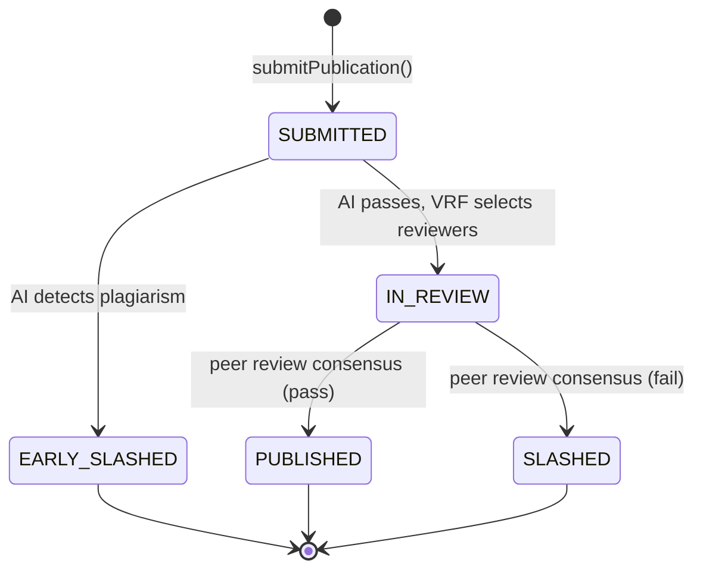

### Terminal outcomes

| Outcome | Publisher | Reviewers |
|:--------|:----------|:----------|
| **Early Slashed** | Stake slashed, reputation penalty | None selected |
| **Published** | Stake returned, reputation boost | Honest: stake + reward + rep · Negligent: slashed stake + rep penalty |
| **Slashed** | Stake slashed, reputation penalty | Honest: stake + reward + rep · Negligent: slashed stake + rep penalty |

---

## Architecture

The protocol is split across three layers, each documented separately:

- **Truth layer** — Solidity contract: [`apps/contracts/README.md`](apps/contracts/README.md)
- **Read model** — event projection and on-chain commands: [`packages/cqrs/README.md`](packages/cqrs/README.md)
- **Orchestration** — submission and review graphs: [`packages/agents/graphs/submission/README.md`](packages/agents/graphs/submission/README.md) · [`packages/agents/graphs/review/README.md`](packages/agents/graphs/review/README.md)

For full sequence diagrams, see [`docs/architecture.md`](docs/architecture.md).

### System overview

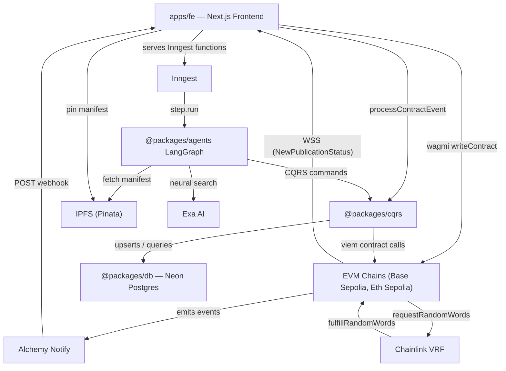

### Event-driven data flow

Contract mutations emit events → Alchemy Notify POSTs a webhook (HMAC-SHA256 verified in [`apps/fe/app/api/webhooks/alchemy/all-events/route.ts`](apps/fe/app/api/webhooks/alchemy/all-events/route.ts)) → `processContractEvent` upserts the Postgres projection → frontend queries hit Postgres. A viem WebSocket client subscribes to `NewPublicationStatus` and invalidates the matching TanStack Query keys on every event, propagating status transitions into open lists in real time.

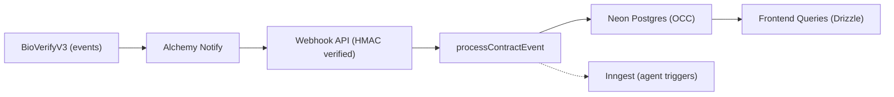

### Agent orchestration

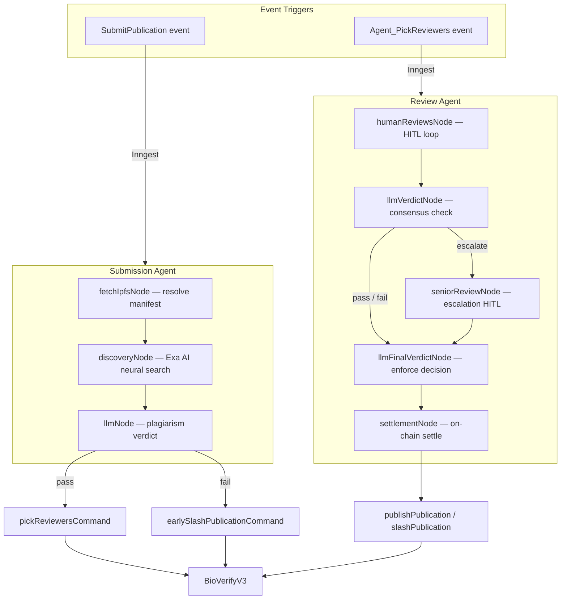

LangGraph uses checkpointers so a workflow can pause for days during human review and resume where it left off. Inngest handles retries and step isolation so failed steps can replay without duplicating side effects when steps are idempotent. Graph-by-graph reference: [`submission/README.md`](packages/agents/graphs/submission/README.md), [`review/README.md`](packages/agents/graphs/review/README.md).

### Smart contract notes

- **CEI + `nonReentrant`** on ETH-out paths (`claim`, `transferSlashPoolToTreasury`).
- **Pull payments** — rewards are credited on-chain; reviewers withdraw via `claim` and pay their own gas, so settlement stays bounded as reviewer count grows.
- **Agent-gated transitions** — sensitive moves use a configured agent address, not arbitrary callers.
- **Getter-less design** — rich state is projected from events instead of heavy on-chain reads for app lists.
- **EIP-712** — peer verdicts are signed off-chain (ECDSA / secp256k1) and verified server-side before on-chain recording.

See [`apps/contracts/README.md`](apps/contracts/README.md) for the full contract reference (types, functions, events, staking mechanics).

### Idempotency and consistency

Webhook handling uses optimistic concurrency on `(blockNumber, logIndex)` to reduce bad overwrites when deliveries retry or arrive out of order (see [`@packages/cqrs`](packages/cqrs/README.md)). Replaying the same events yields the same read model. The projection is eventually consistent with chain tip; confirmation gates or rewind/replay are natural extensions if you need stronger guarantees.

---

## Testing

Smart-contract tests live under [`apps/contracts/test/`](apps/contracts/test/) and run via Foundry — VRF mocks, named revert paths, and a fuzz test on `submitPublication`. The suite is split across 12 files (deployment, payReviewerStake, submitPublication, earlySlash, pickReviewers, fulfillVRF, recordReview, publishPublication, slashPublication, claim, poolManagement, fuzz).

`BioVerifyV3` ships with full coverage on production code:

- **50 tests across 12 suites — all passing.**
- **`src/BioVerifyV3.sol`: 100% lines (241/241), 100% statements (260/260), 100% branches (33/33), 100% functions (26/26).**

See [`apps/contracts/README.md`](apps/contracts/README.md) for the contract reference.

```shell
pnpm contract:test    # forge test
pnpm contract:cov     # forge coverage
```

---

## Tech Stack

### Core architecture

| Area | Technologies |
|------|----------------|
| Smart contracts | Solidity, Foundry, OpenZeppelin, Chainlink VRF V2.5 |
| Agents & AI | LangGraph.js, Gemini (structured output), Exa AI (neural search) |
| Infrastructure | Inngest, Alchemy Notify, Vercel Functions |
| Data & storage | Neon Postgres, IPFS via Pinata |

### Frontend

| Area | Technologies |
|------|----------------|
| UI | Next.js 16 (App Router, RSC), React 19, TypeScript, Tailwind CSS v4, shadcn/ui |
| Web3 | wagmi v3, viem, Reown AppKit (WalletConnect), EIP-712 |
| Client data | TanStack Query v5, Drizzle ORM, nuqs |

### Tooling and quality

| Area | Technologies |
|------|----------------|
| Testing | Foundry (`forge test`, `forge coverage`), VRF mock |
| Lint / schema | Biome (lint + format), Zod |
| Security patterns | CEI, OZ ReentrancyGuard, EIP-712 (ECDSA), HMAC-SHA256 |

---

## Features in Action

### Submitting a publication (success path)

*Split view: BioVerify Telegram bot (left) and DApp (right).*

The author fills in the publication form (metadata and IPFS manifest) and prepares to submit.

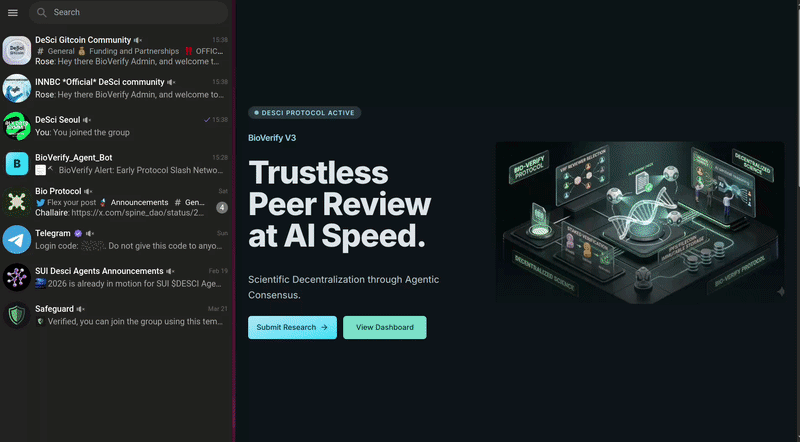


The author confirms the on-chain transaction. The bot receives status notifications as the publication moves from **SUBMITTED** to **IN REVIEW**.

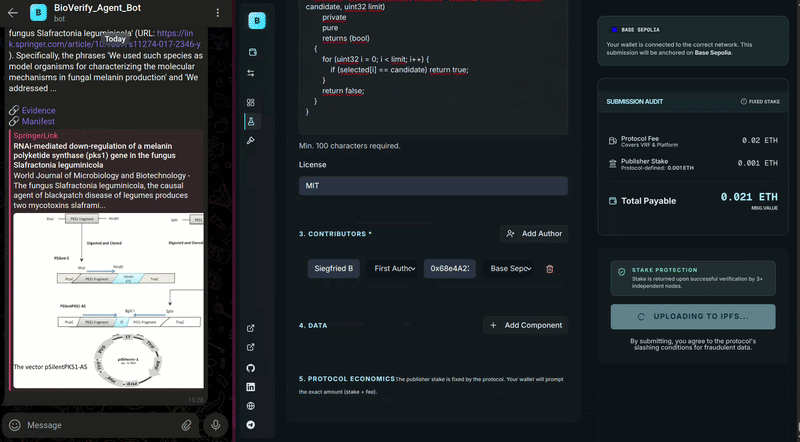

*Watch the Telegram bot reflect each status transition as it happens on-chain.*

The publication detail page shows **IN REVIEW** and the Chainlink VRF–selected reviewers.

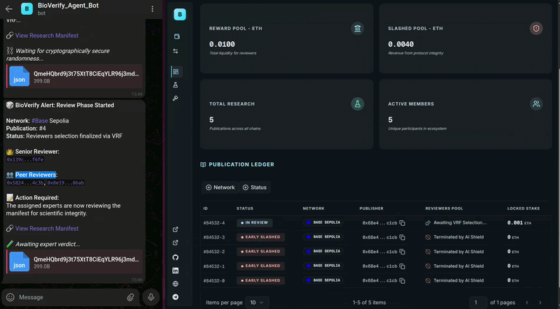

*Watch the VRF-selected reviewer addresses appear in the publication detail panel.*

### Peer review — human-in-the-loop conflict resolution

The first peer reviewer submits a **pass** verdict.

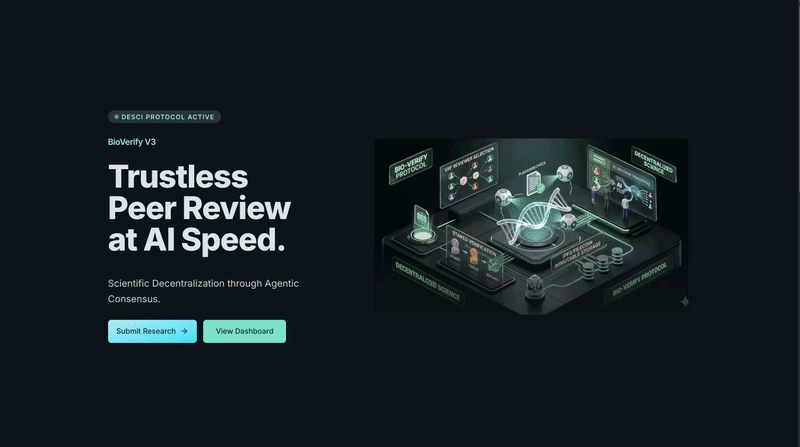

*Watch the Wallet EIP-712 signature prompt — the reviewer signs their verdict off-chain before the agent records it on-chain.*

The second peer reviewer submits a **fail** verdict. The two reviews now conflict, which will trigger the escalation path.

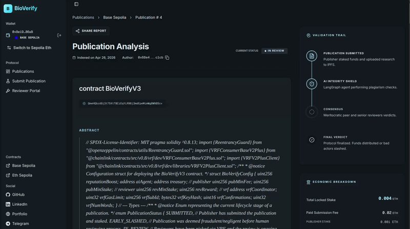


*Split view: Telegram bot (left) and senior reviewer (right).* The bot shows both peer reviews and the agent's decision to escalate. The senior reviewer submits a tie-breaking **pass**.


*Watch the senior reviewer break the tie — the agent resumes the paused LangGraph workflow.*

After the senior review, Telegram reflects **PUBLISHED** and the detail page shows the final verdict from IPFS.

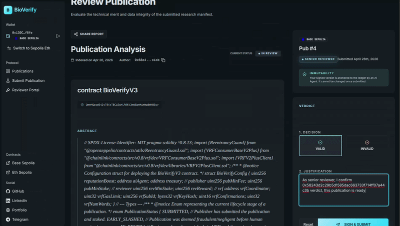

*Watch the final status flip to PUBLISHED and the verdict CID resolve from IPFS.*

### AI plagiarism detection and early slashing

*Dual device view: User A (mobile, no wallet) on `/publications` (left); User B (tablet, wallet on Base Sepolia) (right).*

User B submits a publication that duplicates existing literature.

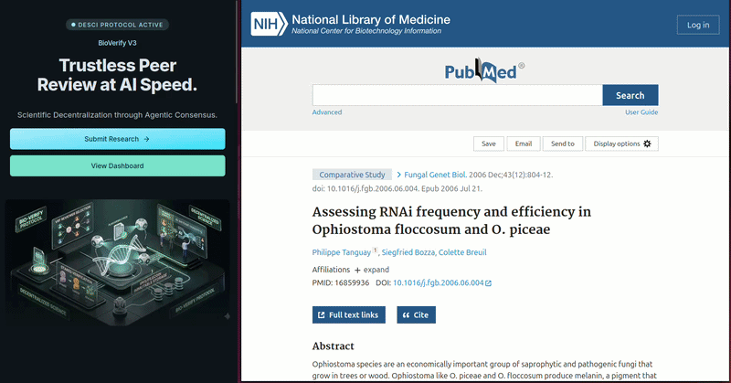


User A sees the row appear in real time over WebSocket (no wallet needed). The publication ends at **EARLY SLASHED** with the AI verdict loaded from IPFS.

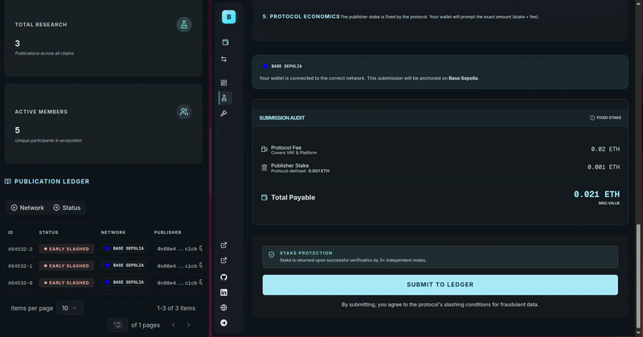

*Watch the publication row appear in User A's list over WebSocket — no wallet, no refresh.*

### Reviewer portal — stake, top-up, claim

A new reviewer joins the pool and pays the reviewer stake.

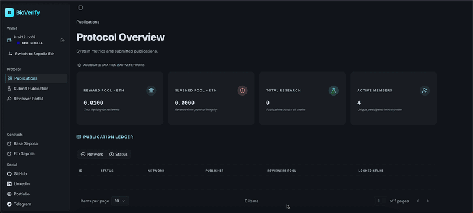

*Watch the reviewer's available stake update after the transaction confirms.*

An existing reviewer tops up so they can be picked in another cycle.

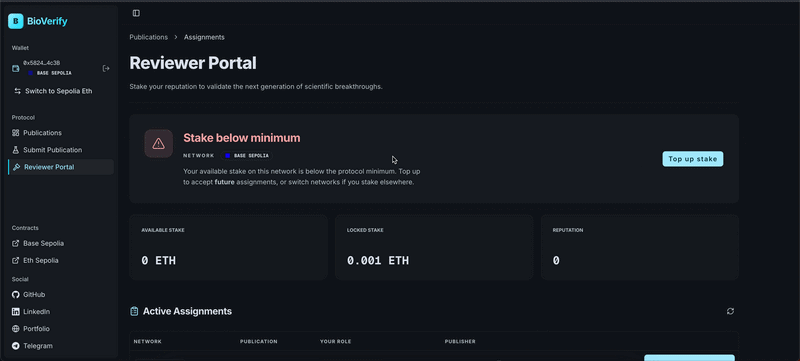

*Watch the available balance increase, making the reviewer eligible for a new review cycle.*

A reviewer claims their available balance (pull withdrawal).

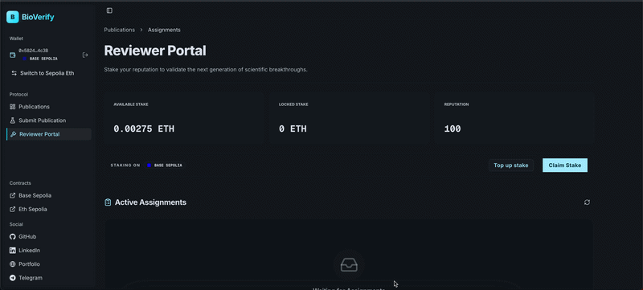

*Watch the pull withdrawal transfer ETH back to the reviewer's wallet.*

### Agent orchestration (Inngest)

Production path: Alchemy webhooks → [`apps/fe/app/api/webhooks/alchemy/all-events/route.ts`](apps/fe/app/api/webhooks/alchemy/all-events/route.ts) → CQRS [`processContractEvent`](packages/cqrs/src/commands/sync/events.ts).

Completed **`submission-agent`** after `CHAIN_SUBMISSION_RECEIVED` (`SubmitPublication` in [`events.ts` lines 158–185](packages/cqrs/src/commands/sync/events.ts)):

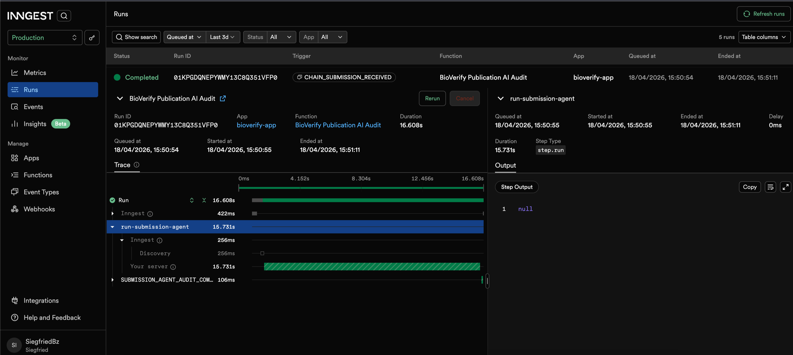

Completed **`review-agent`** after `CHAIN_PICKED_REVIEWERS_RECEIVED` (`Agent_PickReviewers` in [`events.ts` lines 205–229](packages/cqrs/src/commands/sync/events.ts)):

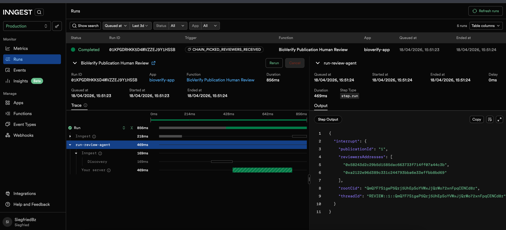

---

## Run it Locally

### Prerequisites

- Node.js 20+
- pnpm 10+
- [Foundry](https://book.getfoundry.sh/) (for contract development)

### Setup

```shell
git clone https://github.com/SiegfriedBz/BioVerify_Agentic_DApp.git
cd BioVerify_Agentic_DApp
pnpm install
cp .env.example .env   # fill in your keys (see packages/env for validation)
```

### Scripts

All scripts run from the monorepo root.

**Frontend**

```shell
pnpm fe:dev                    # start Next.js dev server
pnpm fe:build                  # production build
pnpm fe:start                  # start production server
```

**Contracts**

```shell
pnpm contract:compile          # forge compile
pnpm contract:test             # forge test
pnpm contract:cov              # forge coverage
pnpm contract:deploy:base      # deploy to Base Sepolia + sync config
pnpm contract:deploy:sepolia   # deploy to Ethereum Sepolia + sync config
pnpm contract:sync-config      # regenerate TS config from Foundry artifacts
```

**Database**

```shell
pnpm db:push                   # push Drizzle schema to Neon
pnpm db:seed                   # seed protocol config rows
pnpm db:setup-agents           # initialize LangGraph checkpointer tables
```

**Infrastructure**

```shell
pnpm inngest:dev               # local Inngest dev server
pnpm inngest:sync              # sync Inngest functions to cloud
```

**Quality**

```shell
pnpm lint:check                # Biome lint
pnpm lint:format               # Biome format
```

---

## Deployment

| Network | Contract Address |
|:--------|:-----------------|
| **[Base Sepolia](https://sepolia.basescan.org/address/0x76654c2cdadcf869e78928f0785797b6be20f11b)** | `0x76654c2cdadcf869e78928f0785797b6be20f11b` |
| **[Ethereum Sepolia](https://sepolia.etherscan.io/address/0x7d52170db31be4ab3d0166fbba937a031dc6e1ff)** | `0x7d52170db31be4ab3d0166fbba937a031dc6e1ff` |

---

## Design Decisions and Roadmap

### Current design choices

- **Automated slashing** — When plagiarism is detected in screening, the contract slashes stakes immediately rather than opening a manual appeals path first.
- **Senior reviewer tie-break** — If peer reviewers disagree, the highest-reputation reviewer is escalated via a second HITL step instead of a full quorum re-vote.
- **Getter-less contract** — BioVerifyV3 emits events for state changes and does not expose rich view getters; the app reads from the Postgres projection.

### Known limitations

The current implementation covers the optimistic happy paths. The following edge cases are not handled today and are documented here honestly as the next hardening backlog before any future production use.

- **Empty or malformed IPFS payload.** If a publisher submits a syntactically valid CID that resolves to an empty manifest (or one whose `payload.abstractCid` points at empty content), the submission graph reaches `llmNode` with an empty abstract, the LLM verdict short-circuits without producing `pass`/`fail`, and `agent-start.ts` throws `Unexpected verdict "pending"`. After Inngest's 3 step retries the publication is left stuck in `SUBMITTED`. The fetch helper ([`fetchIpfs`](packages/utils/ipfs/fetch-ipfs.ts)) only validates HTTP status, and there is no Zod validation of the manifest shape inside [`fetchIpfsNode`](packages/agents/graphs/submission/nodes/1.fetch-ipfs.ts). Also, sending an empty abstract to Exa is currently avoided only by a truthy check in [`discoveryNode`](packages/agents/graphs/submission/nodes/2.discovery.ts); the behavior of submitting a non-empty but garbage abstract to Exa AI has not been characterized.

- **Agent transaction failures.** All CQRS commands ([`pickReviewersCommand`](packages/cqrs/src/commands/actions/submission/pick-reviewers.ts), [`earlySlashPublicationCommand`](packages/cqrs/src/commands/actions/submission/early-slash-publication.ts), [`publishPublicationCommand`](packages/cqrs/src/commands/actions/review/publish-publication.ts), `slashPublicationCommand`, `recordReviewCommand`) call `publicClient.simulateContract` then `agentClient.writeContract` once and re-throw on failure. The only retry layer is Inngest's outer `step.run` (3 retries with default backoff). There is no in-command retry with bumped gas, no nonce-conflict recovery, and no detection of transient RPC errors versus actual revert reasons. A gas spike during settlement can today leave a publication in `IN_REVIEW` after the last human review is recorded.

### Roadmap

**Weighted majority voting** — Replace the senior tie-break with consensus weighted by on-chain reputation.

**Reputation via ZK-proofs (Reclaim Protocol)** — Allow privacy-preserving proofs of real-world signals (for example h-index or affiliation) without exposing raw credentials; raises the cost of Sybil identities and collusion at scale. See [Reclaim Protocol](https://www.reclaimprotocol.org/).

**Paid content access (x402)** — Gate full datasets and supplementary material behind micropayments via the [x402 protocol](https://www.x402.org/).

**Encrypted access control (Lit Protocol)** — Encrypt IPFS payloads with [Lit Protocol](https://litprotocol.com/); keys release when on-chain conditions hold (paid, assigned reviewer, or publisher).

**Internal corpus + RAG** — Index published manifests in Neon + pgvector for similarity checks alongside Exa, improving detection for work already inside BioVerify.

---

## Monorepo structure

```
apps/
  contracts/     BioVerifyV3 Solidity contract (Foundry) — see apps/contracts/README.md
  fe/            Next.js 16 frontend — UI, webhook API, Inngest, WebSocket subscriptions — see apps/fe/README.md

packages/
  agents/        LangGraph agents (submission + review)
  cqrs/          Event projector, DB queries, on-chain commands — see packages/cqrs/README.md
  db/            Drizzle ORM client (Neon Postgres) — see packages/db/README.md
  env/           Type-safe env vars (Zod)
  notifications/ Telegram helpers
  schema/        Zod schemas, DB tables, domain types, Inngest event types
  utils/         Contract config, ABI, network mappings, EIP-712 types
  utils-server/  Server-only utilities
```

Deep dives: [`apps/contracts/README.md`](apps/contracts/README.md) · [`apps/fe/README.md`](apps/fe/README.md) · [`packages/cqrs/README.md`](packages/cqrs/README.md) · [`packages/db/README.md`](packages/db/README.md) · [`packages/agents/graphs/submission/README.md`](packages/agents/graphs/submission/README.md) · [`packages/agents/graphs/review/README.md`](packages/agents/graphs/review/README.md)

---

## License

MIT — Siegfried Bozza, 2026

## Author

**Siegfried Bozza** — Full-stack Developer & Web3 Builder (Node.js / React / Next.js / Foundry / Solidity)

[LinkedIn](https://www.linkedin.com/in/siegfriedbozza/) · [GitHub](https://github.com/SiegfriedBz)
