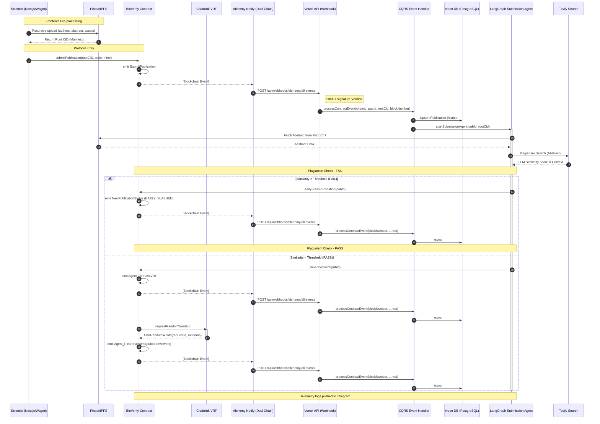
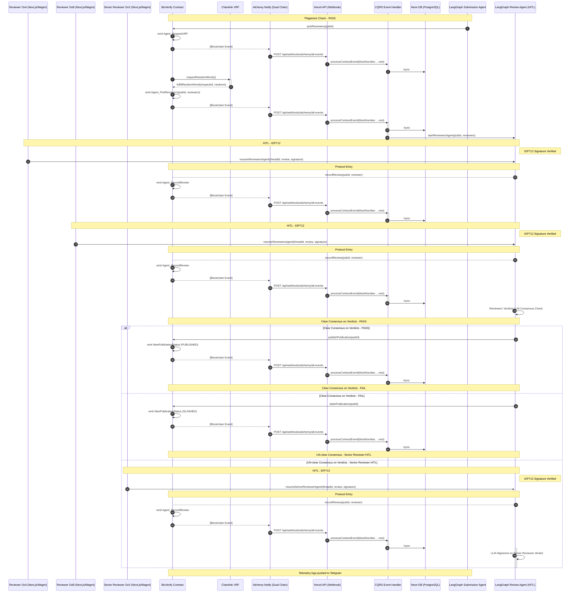

## 🛠 Protocol Roadmap & Status

> **Note:** This project is developed in parallel with a full-time professional software engineering role.

### ✅ Phase 1: Autonomous Foundation & Submission
**Timeline:** Jan 27 — Feb 6, 2026

* **Protocol Engine:** Initial staking logic and submission flow.
* **Agentic Forensic Layer:** LangGraph.js orchestration with Tavily search for literature overlap.
* **Event-Driven Architecture:** Secure Alchemy Notify pipeline for real-time protocol triggers.

---

### ✅ Phase 2: Monorepo Migration, Getter-less BioVerify Contract & CQRS Indexing
**Timeline:** Feb 7 — March 27, 2026

* **Pnpm Monorepo Infrastructure:**
    * **Strict Boundaries:** Modularized the stack into `@packages/agents` (LangGraph), `@packages/db` (Drizzle/Neon), `@packages/schema` (Zod validation), `@packages/utils`, `@packages/utils-server`, and `@packages/cqrs`.
    * **Workspace Apps:** Clean separation between `apps/fe` (Next.js 16) and `apps/contracts` (Foundry).
* **Solidity Getterless Design Pattern (V3):**
    * **Lean EVM:** Systematically removed nearly all on-chain `view` getters, treating the blockchain as a lean "truth engine" to drastically reduce gas costs.
    * **Event-Driven State:** Leveraged emitted events as the primary data source to feed the Neon DB, enabling high-performance queries for the frontend without RPC bottlenecking.
    * **Economics Refinement:** Optimized the **staking and reward logic** to ensure precise distribution.
    * **100% Coverage:** Verified 100% line, function, and branch coverage across the Foundry test suite.
* **Custom CQRS Indexing Pipeline:**
    * **Dual-Chain Webhook Orchestration:** Configured independent **Alchemy Notify** webhooks for Ethereum and Base Sepolia.
    * **The Gateway Service:** A unified Next.js API route that verifies HMAC signatures, normalizes cross-chain payloads, and upserts data into **Neon PostgreSQL**.
    * **Optimistic Concurrency Control (OCC):** Implemented SQL version checks using `lastBlockNumber` and `lastLogIndex` to prevent out-of-order webhook events from overwriting fresh data.
* **Meritocratic Review Orchestration (HITL):**
    * **Cryptographic Integrity:** Implemented **EIP-712 typed data signing** for gasless reviewer verdicts.
    * **AI-Driven Consensus:** A LangGraph engine that evaluates peer variance and triggers **Senior Reviewer** escalation (Golden Truth) upon conflict.
* **Frontend Architecture & React Streaming:**
    * **Advanced Streaming:** Utilized Next.js App Router granular **Suspense** to allow UI shells to render while IPFS content streams in.
    * **TanStack Query / Optimistic UI:** Implemented structured query keys and optimistic updates for interactions like `usePayReviewerStake`, bridging the gap between blockchain finality and UX responsiveness.
    
#### 📊 Submission & Forensic Pipeline

#### 📊 Peer Review & Consensus Flow (HITL)

---

### 🏗 Phase 3: Advanced Forensics & Settlement UI
**Timeline:** March 28, 2026 — Present

* **Universal AI Reasoning:**
    * **[ ] BIOS Integration:** Replace Tavily Search with specialized **BIOS bioprotocol agents**. This upgrades the forensic layer to a science-domain agnostic model for deeper integrity checks across all research fields.
* **Protocol Settlement UI:**
    * **[ ] Reward Claims:** Implement the `claim` interface using **Wagmi/Viem** to allow participants to withdraw available stakes and earned rewards directly from the UI.
    * **[ ] Professional Typography:** Finalize migration of all feature views to the custom `@md` scaling **Typography** components for production-grade readability.
* **UI Polish:**
    * **[ ] Container Query Refinement:** Polish the `@container`-based layout to ensure a fluid, high-end dashboard experience within the `SidebarProvider` shell.
    * **[ ] Real-time Forensic Timeline:** A visual component showing BIOS agent reasoning steps and consensus status as it happens.

---

### 🌍 Deployment Registry

| Network | Contract Address |
| :--- | :--- |
| **Base Sepolia** | `0xa5fd28966be524490d855fbe6e3c830357197251` |
| **Ethereum Sepolia** | `0x1dcb58429f02c627dc726c623a4a9e785ecac3c7` |
