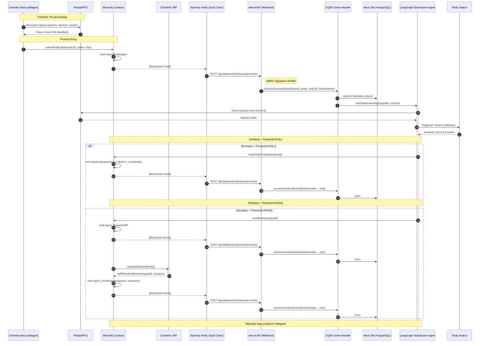

## 🛠 Protocol Roadmap & Status

> **Note:** This project is developed in parallel with a full-time professional software engineering role.

### ✅ Phase 1: Autonomous Foundation & Submission
**Timeline:** Jan 27 — Feb 6, 2026

* **Protocol Engine:** Initial staking logic and submission flow.
* **Agentic Forensic Layer:** LangGraph.js orchestration with Tavily search for literature overlap.
* **Event-Driven Architecture:** Secure Alchemy Notify pipeline for real-time protocol triggers.

---

### ✅ Phase 2: Monorepo Migration & CQRS Indexing
**Timeline:** Feb 7 — March 27, 2026

* **Pnpm Monorepo Architecture:**
    * **Strict Boundaries:** Modularized the stack into `@packages/agents` (LangGraph), `@packages/db` (Drizzle/Neon), `@packages/schema` (Zod validation), `@packages/utils`, `@packages/utils-server`, and `@packages/cqrs`.
    * **Workspace Apps:** Separated concerns between `apps/fe` (Next.js 16) and `apps/contracts` (Foundry).
* **Dual-Chain Webhook Orchestration:**
    * **Unified Pipeline:** Configured independent Alchemy Notify webhooks for **Ethereum Sepolia** and **Base Sepolia**.
    * **The Gateway Service:** Implemented a central **Next.js API Route** as the secure ingestion point. It verifies HMAC signatures, normalizes cross-chain payloads, and upserts data into the unified **Neon PostgreSQL** instance, acting as the bridge between Alchemy and the DB.
* **Getterless Design Pattern (V3):**
    * **Lean EVM:** Refactored Solidity contracts to remove almost all `view` getters, shifting state-tracking to the off-chain indexing pipeline to dramatically reduce gas costs and improve performance.
* **Next.js 16 UI & Forensic UX:**
    * **Advanced Streaming:** Evolved the React Streaming architecture with route-level boundaries and more granular **Suspense** points.
    * **Optimistic UI:** Leveraged TanStack Query to bridge the gap between blockchain finality and UI responsiveness, specifically for reviewer staking and status updates.

---

### 🏗 Phase 3: Advanced Forensics & Settlement UI
**Timeline:** March 28, 2026 — Present

* **Universal AI Reasoning:**
    * **[ ] BIOS Integration:** Replace Tavily Search with specialized **BIOS bioprotocol agents**. This upgrades the forensic layer to a science-domain agnostic model for deeper integrity checks across all research fields.
* **Protocol Settlement UI:**
    * **[ ] Reward Claims:** Implement the `claim` interface using **Wagmi/Viem** to allow participants to withdraw available stakes and earned rewards directly from the UI.
    * **[ ] Professional Typography:** Finalize migration of all feature views to the custom `@md` scaling **Typography** components for production-grade readability.
* **UI Polish:**
    * **[ ] Container Query Refinement:** Polish the `@container`-based layout to ensure a fluid, high-end dashboard experience within the `SidebarProvider` shell.
    * **[ ] Real-time Forensic Timeline:** A visual component showing BIOS agent reasoning steps and consensus status as it happens.

---

### 🌍 Deployment Registry

| Network | Contract Address |
| :--- | :--- |
| **Base Sepolia** | `0xa5fd28966be524490d855fbe6e3c830357197251` |
| **Ethereum Sepolia** | `0x1dcb58429f02c627dc726c623a4a9e785ecac3c7` |
