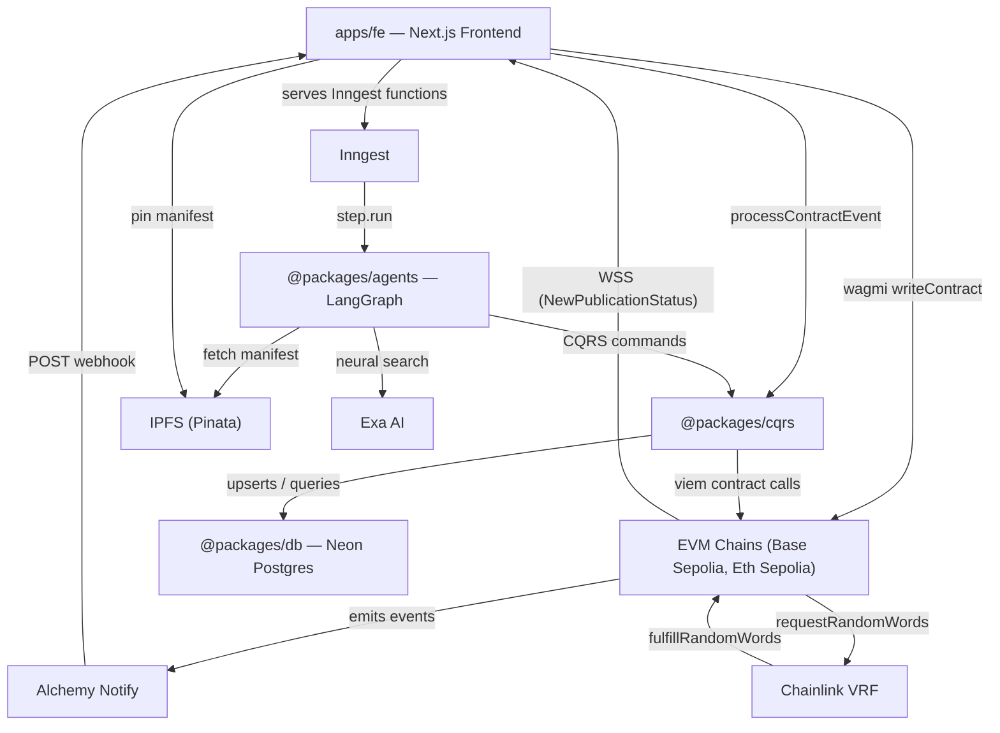
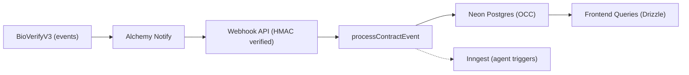
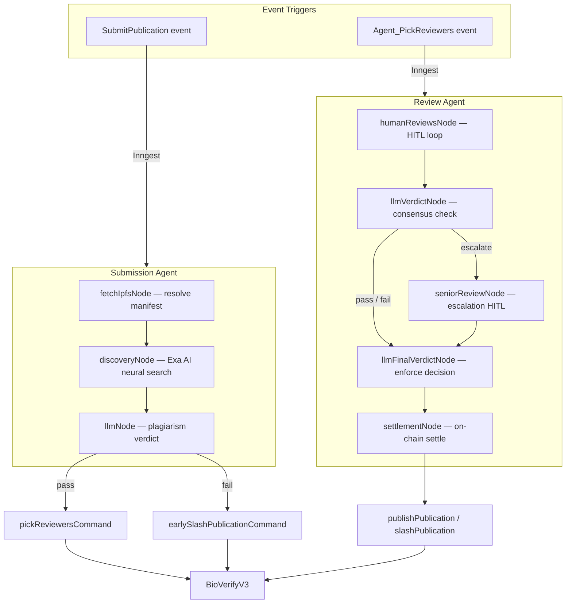
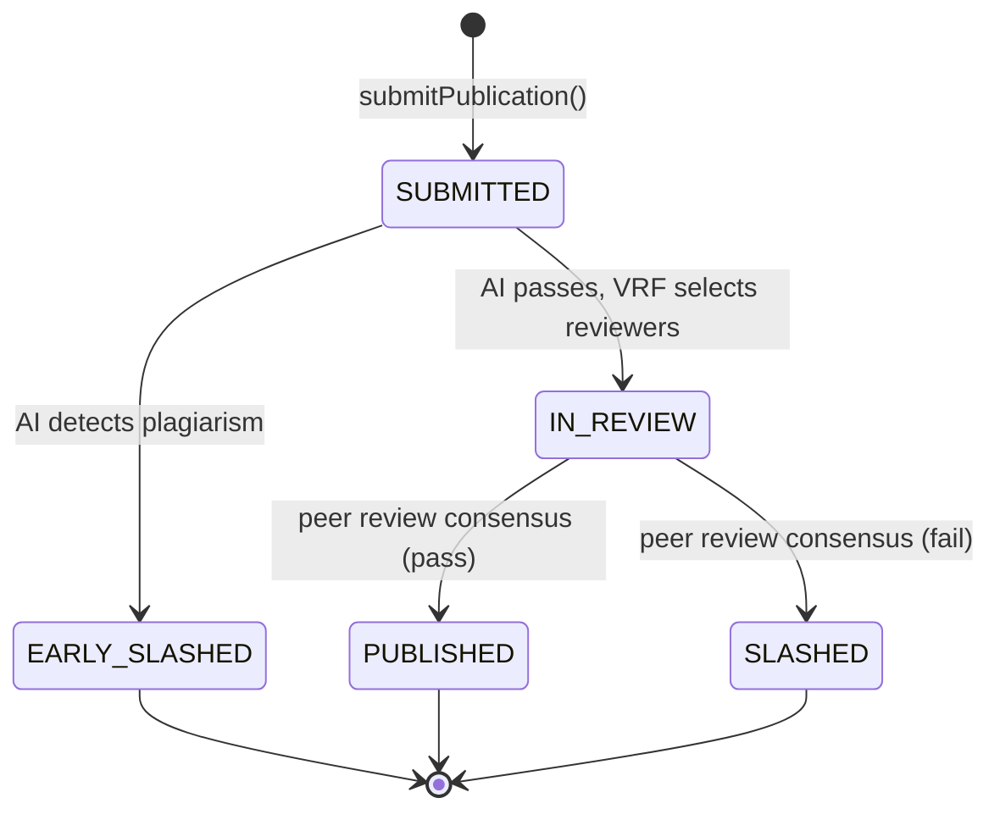

# 🧬 BioVerify

## 🧪 Quick Start

1. **Try the Demo:** [🌐 Live Demo](https://bio-verify-agentic-dapp.vercel.app)
2. **Get Testnet Sepolia ETH:** [Sepolia Faucet](https://sepolia-faucet.pk910.de/)
3. **Swap for Base Sepolia ETH:** [Superbridge](https://superbridge.app/base-sepolia) (only if you want to use Base)
4. **Connect your wallet** to the DApp (Base Sepolia or Ethereum Sepolia)
5. **Submit a publication** and/or **register as a reviewer** and let the agents do the rest!

---

**Durable AI Agent Protocol for Scientific Integrity**

A decentralized science (DeSci) protocol that replaces opaque, slow, and biased traditional peer review with stateful AI agents and on-chain game theory. Scientists stake collateral to submit research, autonomous agents screen for plagiarism, Chainlink VRF selects unbiased reviewers, and cryptographic consensus settles stakes — creating an immutable, economically enforced pipeline for scientific truth.

## The Problem

The reproducibility crisis is real: a [2016 Nature survey](https://www.nature.com/articles/533452a) found that over 70% of researchers failed to reproduce another scientist's results. The root cause is a peer-review system with no accountability, no public audit trail, and no economic consequences for negligence.

Traditional peer review is a closed-door process. Reviewers face no consequences for approving fraudulent work or rejecting valid research. There is no on-chain record, no transparency, and no mechanism to reward diligence. The result: retractions, wasted funding, and eroded public trust in science.

BioVerify targets the **peer-review accountability layer** specifically — the part of the pipeline where economic staking, AI-assisted forensics, and transparent on-chain settlement can have the most immediate impact on research integrity.

## How BioVerify Works

1. **Stake and Submit** — A scientist uploads their research manifest to IPFS (via Pinata) and submits it on-chain with a collateral stake and submission fee.
2. **AI Forensic Screening** — The Submission Agent fetches the abstract from IPFS, runs a neural search against academic literature via Exa AI, and produces a structured LLM verdict (pass or fail). Plagiarism triggers immediate on-chain slashing.
3. **VRF Reviewer Selection** — If the submission passes, Chainlink VRF selects $N$ peer reviewers from the staked pool using cryptographically verifiable randomness. The reviewer with the highest reputation is assigned as Senior Reviewer.
4. **Human-in-the-Loop Peer Review** — Selected reviewers submit EIP-712-signed verdicts through the frontend. Each review resumes the Review Agent's HITL interrupt. If peer verdicts conflict, the Senior Reviewer is called to break the tie.
5. **On-Chain Settlement** — The agent partitions reviewers into honest (aligned with the final decision) and negligent (opposed), then settles on-chain: honest reviewers are rewarded, negligent reviewers are slashed, and the publisher's stake is returned or forfeited.

## Architecture

### System Overview

How the monorepo packages connect to each other and to external services.



### Event-Driven Data Flow

The contract uses a getter-less design: all state mutations emit events. These are projected off-chain into a Postgres read model, which powers all frontend queries. No on-chain reads required. In parallel, the frontend subscribes to `NewPublicationStatus` events via standalone viem WebSocket clients (Alchemy WSS), independent of wallet connection state, debouncing cache invalidations so the publications list, global stats strip, and related TanStack Query caches stay in sync without polling the table.



### Agent Orchestration & Durability

Logic state and execution durability are separated to handle the asynchronous nature of human review:

- **LangGraph** manages the agent lifecycle using checkpointers. This allows the workflow to pause for days during peer review and resume exactly where it left off.
- **Inngest** provides the durable execution layer — automatic retries for on-chain commands, wait-for-event logic, and fan-out orchestration.



### Publication Lifecycle

The `PublicationStatus` state machine on-chain.



For detailed end-to-end sequence diagrams with every interaction, see [`docs/architecture.md`](docs/architecture.md).

## Monorepo Structure

pnpm workspaces with two apps and seven packages.

```
apps/
  contracts/          BioVerifyV3 Solidity contract (Foundry) — staking, VRF, settlement
  fe/                 Next.js 16 frontend — DApp UI, webhook API, Inngest serving, WSS event subscriptions

packages/
  agents/             LangGraph AI agents (submission + review)
  cqrs/               Event projector, DB queries, on-chain action commands
  db/                 Drizzle ORM client (Neon Postgres)
  env/                Type-safe environment variable access (Zod)
  notifications/      Telegram notification helpers
  schema/             Zod schemas, DB table definitions, domain types, Inngest event types
  utils/              Contract config, ABI, network mappings, EIP-712 type definitions
  utils-server/       Server-only utilities
```

## Tech Stack

| Layer | Technologies |
|-------|-------------|
| Smart Contracts | Solidity, Foundry, OpenZeppelin, Chainlink VRF V2.5 |
| Frontend | Next.js 16 (App Router, RSC), React 19, TypeScript, Tailwind CSS v4, shadcn/ui |
| Web3 | wagmi v3, viem, Reown AppKit (WalletConnect), EIP-712 typed data signing |
| AI Agents | LangGraph.js, Gemini (structured output), Exa AI (neural search) |
| Data | Drizzle ORM, Neon Postgres (serverless), TanStack Query v5, nuqs (URL state) |
| Storage | IPFS via Pinata (publication manifests, verdict pinning) |
| Infrastructure | Inngest (durable execution), Alchemy Notify (webhooks), Vercel Functions |
| Quality | Biome (lint + format), Foundry tests (100% branch coverage) |

## Getting Started

### Prerequisites

- Node.js 20+
- pnpm 10+
- [Foundry](https://book.getfoundry.sh/) (for contract development)

### Setup

```shell
git clone https://github.com/SiegfriedBz/BioVerify_Agentic_DApp.git
cd BioVerify_Agentic_DApp
pnpm install
cp .env.example .env   # fill in your keys (see packages/env for validation)
```

### Scripts

All scripts run from the monorepo root.

**Frontend**

```shell
pnpm fe:dev                    # start Next.js dev server
pnpm fe:build                  # production build
pnpm fe:start                  # start production server
```

**Contracts**

```shell
pnpm contract:compile          # forge compile
pnpm contract:test             # forge test
pnpm contract:cov              # forge coverage
pnpm contract:deploy:base      # deploy to Base Sepolia + sync config
pnpm contract:deploy:sepolia   # deploy to Ethereum Sepolia + sync config
pnpm contract:sync-config      # regenerate TS config from Foundry artifacts
```

**Database**

```shell
pnpm db:push                   # push Drizzle schema to Neon
pnpm db:seed                   # seed protocol config rows
pnpm db:setup-agents           # initialize LangGraph checkpointer tables
```

**Infrastructure**

```shell
pnpm inngest:dev               # local Inngest dev server
pnpm inngest:sync              # sync Inngest functions to cloud
```

**Quality**

```shell
pnpm lint:check                # Biome lint
pnpm lint:format               # Biome format
```

## Deployment

| Network | Contract Address |
|:--------|:-----------------|
| **[Base Sepolia](https://sepolia.basescan.org/address/0x76654c2cdadcf869e78928f0785797b6be20f11b)** | `0x76654c2cdadcf869e78928f0785797b6be20f11b` |
| **[Ethereum Sepolia](https://sepolia.etherscan.io/address/0x7d52170db31be4ab3d0166fbba937a031dc6e1ff)** | `0x7d52170db31be4ab3d0166fbba937a031dc6e1ff` |

## Design Decisions & Roadmap

### Current Design Choices

- **Automated Slashing** — The AI agent slashes stakes immediately when plagiarism is detected, prioritizing protocol efficiency over manual appeals.
- **Senior Reviewer Tie-Break** — When peer reviewers disagree, the highest-reputation reviewer is escalated via a second HITL interrupt to cast the deciding verdict, rather than requiring a full quorum re-vote.
- **Getter-Less Contract** — BioVerifyV3 emits events for every state mutation and exposes no view functions. All reads are served from the off-chain Postgres projection, keeping gas costs minimal and the contract surface small.

### Roadmap

**Weighted Majority Voting** — Replace the Senior Reviewer tie-breaker with a decentralized consensus mechanism where reviewer votes are weighted by on-chain reputation score.

**Reputation via ZK-Proofs (Reclaim Protocol)** — Reviewer reputation is currently bootstrapped from on-chain history alone. Integration with [Reclaim Protocol](https://www.reclaimprotocol.org/) would allow scientists to import real-world credentials (h-index, citation count, institutional affiliation) via zero-knowledge proofs, solving the cold-start problem.

**Paid Content Access (x402)** — Integration of the [x402 protocol](https://www.x402.org/) to gate publication content behind micropayments. Non-publishers and non-reviewers would pay to access full research data (datasets, methodology, supplementary materials) through x402's HTTP 402-based payment flow, creating a sustainable revenue stream for honest publishers.

**Encrypted Access Control (Lit Protocol)** — Publication data on IPFS would be encrypted using [Lit Protocol](https://litprotocol.com/). Decryption keys are only released when on-chain conditions are met — "has paid via x402", "is an assigned reviewer", or "is the publisher" — combining payment verification with decentralized key management and removing the need for a centralized access server.

Together, these roadmap items would extend BioVerify from a pure integrity protocol into a full research marketplace: **stake-to-publish, pay-to-read, earn-to-review**.

## License

MIT — Siegfried Bozza, 2026

## Author

Built solo (in parallel with a full-time professional software engineering role) by **Siegfried Bozza**: Full-stack development, smart contract, and deployment.

Full-Stack Developer React/Next.js & Web3

💼 [LinkedIn](https://www.linkedin.com/in/siegfriedbozza/)
🐙 [GitHub](https://github.com/SiegfriedBz)
