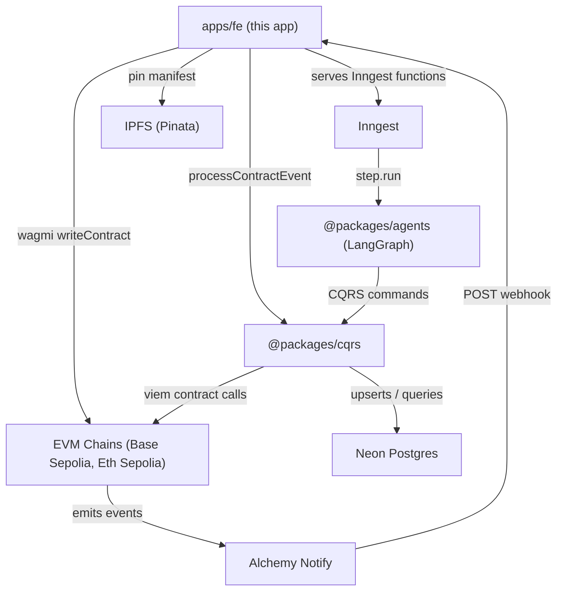
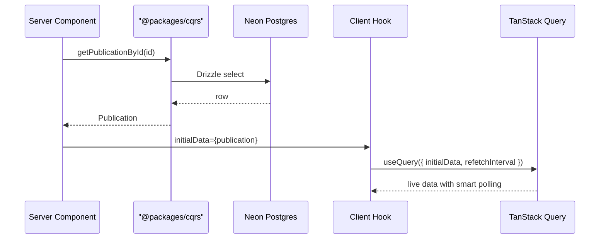
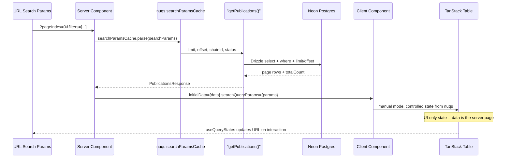
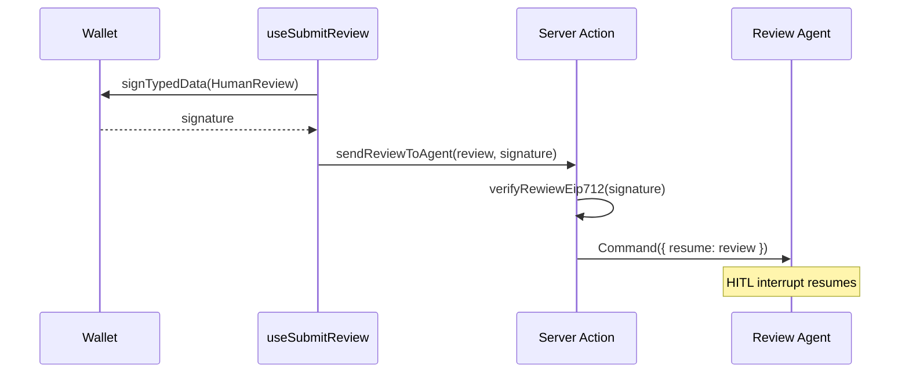

# BioVerify Frontend

Next.js 16 App Router DApp for decentralized scientific peer review. Scientists submit publications on-chain, AI agents validate originality, Chainlink VRF selects peer reviewers, and human verdicts settle stakes -- all orchestrated through this interface.

This is the user-facing application within the [BioVerify monorepo](../../README.md). It connects the on-chain protocol ([`apps/contracts`](../contracts/README.md)) to the off-chain AI agents ([Submission](../../packages/agents/graphs/submission/README.md), [Review](../../packages/agents/graphs/review/README.md)) through a CQRS event-projection layer ([`@packages/cqrs`](../../packages/cqrs/README.md)).

## Tech Stack

| Category | Technologies |
|----------|-------------|
| Framework | Next.js 16 (App Router, RSC, Server Actions), React 19, TypeScript |
| Web3 | wagmi v3, viem, Reown AppKit (WalletConnect), EIP-712 typed data signing |
| Storage | IPFS (Pinata) for publication manifests and verdict pinning |
| Data | TanStack Query v5, `@packages/cqrs` (server-side queries via `"use server"` bridge), Drizzle ORM |
| Tables | TanStack Table v8 + custom `niko-table` component library, nuqs (URL state sync) |
| Forms | react-hook-form + zod validation |
| UI | Tailwind CSS v4, shadcn/ui, Lucide icons, next-themes, sonner -- fully responsive |
| Infra | Inngest (durable agent execution), Alchemy Notify (webhooks), Vercel Functions (`waitUntil`) |

## Monorepo Context



| Package | Role |
|---------|------|
| [`apps/contracts`](../contracts/README.md) | BioVerifyV3 Solidity contract (staking, VRF, settlement) |
| [`@packages/cqrs`](../../packages/cqrs/README.md) | Event sync projector, DB queries, on-chain action commands |
| [`@packages/agents`](../../packages/agents/graphs/submission/README.md) | LangGraph AI agents (submission + review) |
| `@packages/schema` | Zod schemas, DB table definitions, domain types, Inngest event types |
| `@packages/db` | Drizzle ORM client (Neon Postgres) |
| `@packages/utils` | Contract config, ABI, network mappings, EIP-712 type definitions |
| `@packages/env` | Type-safe environment variable access |

## Architecture

### Provider Hierarchy

Two provider trees serve different route groups:

- **`RootProviders`** (home): ThemeProvider -> CustomWagmiProvider (Reown AppKit + TanStack QueryClientProvider + NuqsAdapter) -> TooltipProvider
- **`SideProvider`** (publications): Same stack plus `AppSideBarProvider` wrapping a collapsible sidebar layout

`CustomWagmiProvider` initializes Reown AppKit with `baseSepolia` and `sepolia` networks, configures Alchemy RPC transports with WebSocket-first fallback, and hydrates wallet state from cookies for SSR.

### Data Flow

Server Components fetch initial data directly from `@packages/cqrs` (which reads the Neon Postgres projection of on-chain state), then pass it as `initialData` to client-side TanStack Query hooks. This gives instant server-rendered content with seamless client-side reactivity.



**Smart polling**: Query hooks like `usePublicationDetail` use a dynamic `refetchInterval` that polls every 5 seconds while a publication is in a pending state, and automatically stops polling once it reaches a terminal status (`PUBLISHED`, `SLASHED`, or `EARLY_SLASHED`). The `PublicationDetailsProvider` context wraps this pattern, exposing live publication data and a syncing indicator to all child components.

### CQRS Bridge

The `_api/queries/index.ts` file is a `"use server"` re-export of all `@packages/cqrs` query functions. This makes server-only Drizzle queries callable from client-side TanStack Query hooks through Next.js Server Actions, keeping database access strictly server-side while the client gets reactive data.

### Server-Side Filtering and Pagination

The `/publications` table uses **nuqs** as the single source of truth for all table UI state, persisted in URL search params (`pageIndex`, `pageSize`, `sort`, `filters`). Filtering and pagination are server-side -- the server component reads the URL, queries the database, and returns only the matching page.



The flow:

1. `page.tsx` parses incoming search params into the nuqs cache via `createSearchParamsCache`.
2. `PublicationsTableWrapper` (server component) reads the cache, extracts `limit`, `offset`, `chainId`, and `status`, and calls `getPublications()` from `@packages/cqrs`.
3. TanStack Table runs in **manual** mode (`manualFiltering`, `manualSorting`, `manualPagination`) -- it drives UI state only; `data` is already the server-filtered page.
4. On the client, `useQueryStates` (with `shallow: false`) updates the URL on any filter/page change, triggering a server-side re-render with fresh params.

| Server-side param | Source | Description |
|-------------------|--------|-------------|
| `chainId` | Faceted column filter | Filter by network (Base Sepolia, Eth Sepolia) |
| `status` | Faceted column filter | Filter by publication status |
| `limit` / `offset` | `pageSize` / `pageIndex` | Offset-based pagination |

`sort` is tracked in the URL for UI state persistence but is **not** applied server-side -- the query always orders by `createdAt desc`.

### Command Hooks

Write operations (`useSubmitPublication`, `usePayReviewerStake`, `useSubmitReview`) each wrap `writeContract` or `signTypedData` from `@wagmi/core` using the shared `reownConfig`. After a successful transaction:

1. **Optimistic cache update** via `queryClient.setQueryData` for instant UI feedback
2. **Delayed invalidation** (3 seconds) via `queryClient.invalidateQueries` to sync with the Neon projection once the Alchemy webhook has processed the on-chain event

### EIP-712 Review Signing

Peer reviewers submit verdicts through an EIP-712 typed data signing flow:



The server action verifies the EIP-712 signature, then resumes the LangGraph review agent's HITL interrupt with the verified review payload.

## Routes

| Route | Description |
|-------|-------------|
| `/` | Landing page with protocol mechanism walkthrough and CTAs |
| `/publications` | Server-side paginated and filtered publications table. nuqs syncs filters (chain, status, page) to URL search params; server component passes them to the CQRS query. TanStack Table in manual mode. |
| `/publications/new` | Submit publication form (react-hook-form + zod, IPFS manifest pinning via Pinata, on-chain `submitPublication`) |
| `/publications/[chainId]/[pubId]` | Publication detail with live smart-polling, verdict timeline, economics sidebar, participants list |
| `/publications/[chainId]/[pubId]/review` | Reviewer form with EIP-712 signing and agent handoff |
| `/publications/assignments` | Reviewer dashboard: stake management, assigned publications table, review status tracking |

## API Routes

| Endpoint | Method | Description |
|----------|--------|-------------|
| `/api/webhooks/alchemy/all-events` | POST | Alchemy Notify webhook. HMAC-verified per network, decodes contract logs with `viem`, calls `processContractEvent` from `@packages/cqrs` (DB projection + Inngest event triggers). Uses `waitUntil` for non-blocking processing. |
| `/api/inngest` | GET/POST/PUT | Inngest function serving endpoint. Registers three durable functions: `auditPublicationSubmission`, `auditComplete`, `reviewPublication`. |

## Key Patterns

- **Smart polling** -- `refetchInterval` dynamically stops when a publication reaches a terminal status, eliminating unnecessary network requests
- **Optimistic updates + delayed invalidation** -- immediate UI feedback on transactions, with a 3-second delayed cache invalidation to account for Alchemy webhook -> CQRS projection latency
- **Server-first data loading** -- RSC fetches from Neon via `@packages/cqrs`, hydrates client hooks via `initialData` for zero-loading-state initial renders
- **`"use server"` CQRS bridge** -- all Drizzle DB queries stay server-only, exposed to client hooks through Next.js Server Actions
- **Cookie-based SSR wallet state** -- `getAuthFromCookies` extracts the connected address and chain from wagmi's cookie storage, enabling server-side data fetching scoped to the user's wallet and network

## Development

All commands run from the **monorepo root** (not from `apps/fe/`):

```shell
pnpm fe:dev            # start Next.js dev server (with env check)
pnpm fe:build          # production build
pnpm fe:start          # start production server
pnpm lint:check        # Biome lint (apps/fe + packages/)
pnpm lint:format       # Biome format
```
