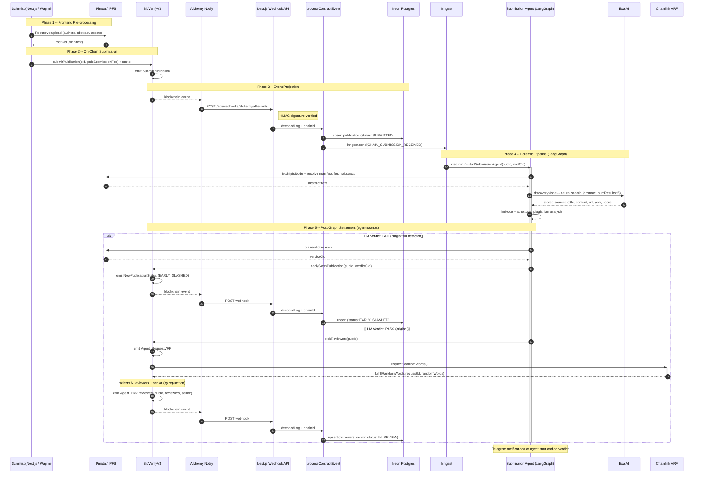
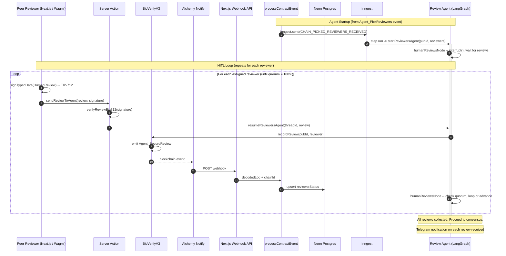
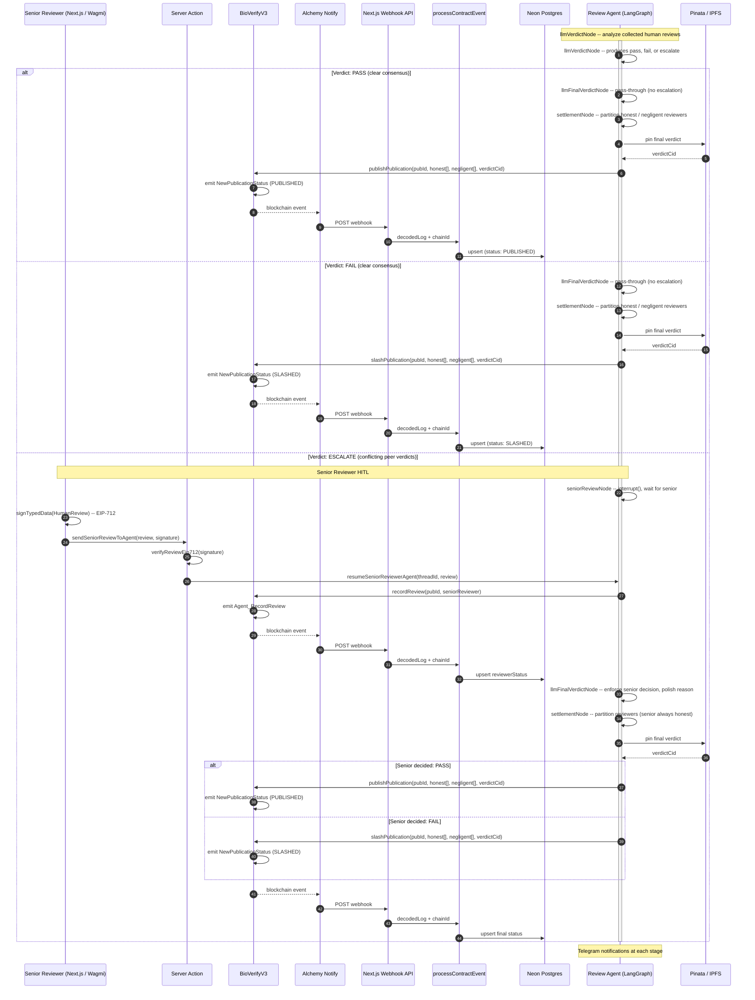

# Architecture

End-to-end flow diagrams for the BioVerify protocol. Each diagram is cross-referenced against the implementation and package READMEs.

For package-level details see:
- [`apps/contracts`](../apps/contracts/README.md) -- BioVerifyV3 smart contract (staking, VRF, settlement)
- [`apps/fe`](../apps/fe/README.md) -- Next.js frontend, webhook API, Inngest serving
- [`@packages/cqrs`](../packages/cqrs/README.md) -- Event projector, DB queries, on-chain action commands
- [`@packages/agents` (Submission)](../packages/agents/graphs/submission/README.md) -- LangGraph submission agent
- [`@packages/agents` (Review)](../packages/agents/graphs/review/README.md) -- LangGraph review agent
- [`@packages/db`](../packages/db/README.md) -- Drizzle ORM client (Neon Postgres)

---

## Submission & Forensic Pipeline

A scientist submits a publication on-chain. The event flows through the infrastructure pipeline into the Submission Agent, which fetches the abstract from IPFS, runs a neural search for prior art via Exa AI, and produces an LLM verdict. The post-graph logic either slashes the publisher (fail) or triggers Chainlink VRF reviewer selection (pass).

---

## Peer Review Flow

The review flow is split into two diagrams for readability: (1) how reviews are collected via HITL interrupts, and (2) how consensus is reached and settled on-chain.

### 1. Review Collection (HITL)

The `Agent_PickReviewers` event triggers the Review Agent via Inngest. The agent immediately hits an HITL interrupt and waits for each assigned reviewer to submit an EIP-712-signed verdict. Each review resumes the graph, records the review on-chain, and loops until all assigned reviewers have responded.

### 2. Consensus & Settlement

Once all reviews are in, the LLM analyzes the collected verdicts. If consensus is clear (all agree), it passes through to settlement. If verdicts conflict, the flow escalates to a senior reviewer (another HITL interrupt), whose decision is enforced by the LLM before settling on-chain.

