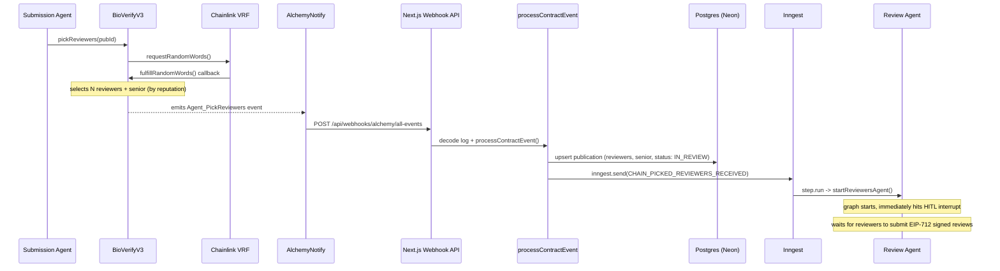
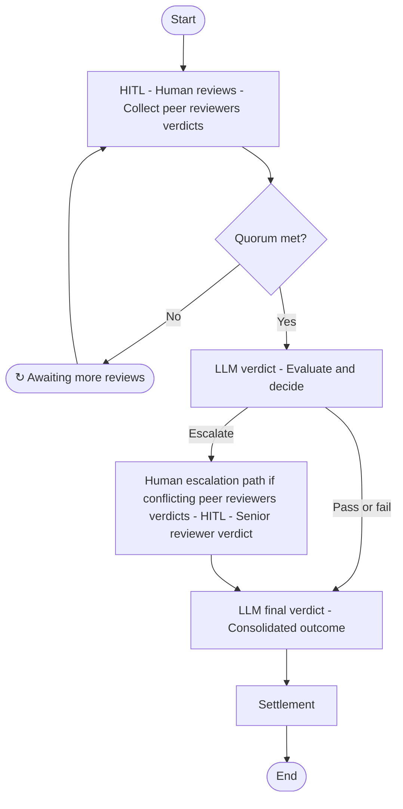

# Review Agent

LangGraph agent that orchestrates the peer-review verification pipeline for scientific publications. Combines Human-in-the-Loop (HITL) review collection with AI-driven forensic analysis and an optional senior reviewer escalation path.

## Trigger Chain

This agent is only started if the [Submission Agent](../submission/README.md) **passed** the plagiarism check and called `pickReviewersCommand()` on-chain. That function triggers a Chainlink VRF request. When the VRF callback `fulfillRandomWords()` executes, it selects N reviewers plus a senior reviewer (highest reputation), then emits `Agent_PickReviewers`. That event flows through the infrastructure pipeline to start this agent:

1. **Alchemy Notify** watches the `BioVerifyV3` contract and POSTs raw logs to the Next.js webhook at `apps/fe/app/api/webhooks/alchemy/all-events/route.ts`.
2. The webhook decodes each log with `viem` and calls `processContractEvent()` from `@packages/cqrs`, which upserts the publication (with reviewer addresses and senior reviewer) into Postgres and emits an Inngest event.
3. The Inngest function `review-publication` picks up `CHAIN_PICKED_REVIEWERS_RECEIVED` and runs `startReviewersAgent()` inside a durable `step.run`.

## Graph

### Nodes

| # | Node | What it does |
|---|------|-------------|
| 1 | `humanReviewsNode` | **HITL interrupt.** Waits for each assigned peer reviewer to submit an EIP-712-signed review. Self-loops until the full quorum is met. Each incoming review triggers `recordReviewCommand` (on-chain `recordReview`). |
| 2 | `llmVerdictNode` | **Forensic Auditor.** Gemini (`gemini-2.5-flash-lite`) with structured output analyzes the collected human reviews. Produces `pass`, `fail`, or `escalate`. |
| 3 | `seniorReviewNode` | **Escalation path** (conditional -- only entered on `escalate`, i.e. when peer reviewers verdicts are conflicting). Another HITL interrupt that waits for the senior reviewer's EIP-712-signed decision. |
| 4 | `llmFinalVerdictNode` | **Forensic Secretary.** If escalated, enforces the senior reviewer's decision while polishing the reasoning for on-chain storage. If not escalated, passes through the existing verdict. |
| 5 | `settlementNode` | **On-chain settlement.** Partitions reviewers into honest/negligent based on alignment with the final decision. Calls `publishPublicationCommand` (on-chain `publishPublication`) (pass) or `slashPublicationCommand` (on-chain `slashPublication`) (fail). |

### State

| Field | Type | Default |
|-------|------|---------|
| `network` | `NetworkT` | -- |
| `publicationId` | `string` | -- |
| `rootCid` | `string` | -- |
| `humanReviews` | `HumanReview[]` | `[]` |
| `llmVerdict` | `{ decision, reason }` | `{ decision: "pending", reason: "" }` |
| `seniorReview` | `HumanReview` | `{ address: "" }` |

## Resume Paths (HITL)

The graph uses LangGraph's `interrupt()` / `Command({ resume })` mechanism. Two entry points wake it up from outside:

| Function | When it is called |
|----------|-------------------|
| `resumeReviewersAgent` | A peer reviewer submits their review. Verifies the EIP-712 signature, confirms the signer is an assigned reviewer, then resumes the graph with the review payload. |
| `resumeSeniorReviewerAgent` | The senior reviewer submits their escalation decision. Verifies the EIP-712 signature, confirms the signer matches the assigned senior reviewer and the verdict was escalated, then resumes the graph. |

## Outcomes
# Review Agent

LangGraph agent that orchestrates the peer-review verification pipeline for scientific publications. Combines Human-in-the-Loop (HITL) review collection with AI-driven forensic analysis and an optional senior reviewer escalation path.

## Trigger Chain

This agent is only started if the [Submission Agent](../submission/README.md) **passed** the plagiarism check and called `pickReviewersCommand()` on-chain. That function triggers a Chainlink VRF request. When the VRF callback `fulfillRandomWords()` executes, it selects N reviewers plus a senior reviewer (highest reputation), then emits `Agent_PickReviewers`. That event flows through the infrastructure pipeline to start this agent:

1. **Alchemy Notify** watches the `BioVerifyV3` contract and POSTs raw logs to the Next.js webhook at `apps/fe/app/api/webhooks/alchemy/all-events/route.ts`.
2. The webhook decodes each log with `viem` and calls `processContractEvent()` from `@packages/cqrs`, which upserts the publication (with reviewer addresses and senior reviewer) into Postgres and emits an Inngest event.
3. The Inngest function `review-publication` picks up `CHAIN_PICKED_REVIEWERS_RECEIVED` and runs `startReviewersAgent()` inside a durable `step.run`.

## Graph

### Nodes

| # | Node | What it does |
|---|------|-------------|
| 1 | `humanReviewsNode` | **HITL interrupt.** Waits for each assigned peer reviewer to submit an EIP-712-signed review. Self-loops until the full quorum is met. Each incoming review triggers `recordReviewCommand` (on-chain `recordReview`). |
| 2 | `llmVerdictNode` | **Forensic Auditor.** Gemini (`gemini-2.5-flash-lite`) with structured output analyzes the collected human reviews. Produces `pass`, `fail`, or `escalate`. |
| 3 | `seniorReviewNode` | **Escalation path** (conditional -- only entered on `escalate`, i.e. when peer reviewers verdicts are conflicting). Another HITL interrupt that waits for the senior reviewer's EIP-712-signed decision. |
| 4 | `llmFinalVerdictNode` | **Forensic Secretary.** If escalated, enforces the senior reviewer's decision while polishing the reasoning for on-chain storage. If not escalated, passes through the existing verdict. |
| 5 | `settlementNode` | **On-chain settlement.** Partitions reviewers into honest/negligent based on alignment with the final decision. Calls `publishPublicationCommand` (on-chain `publishPublication`) (pass) or `slashPublicationCommand` (on-chain `slashPublication`) (fail). |

### State

| Field | Type | Default |
|-------|------|---------|
| `network` | `NetworkT` | -- |
| `publicationId` | `string` | -- |
| `rootCid` | `string` | -- |
| `humanReviews` | `HumanReview[]` | `[]` |
| `llmVerdict` | `{ decision, reason }` | `{ decision: "pending", reason: "" }` |
| `seniorReview` | `HumanReview` | `{ address: "" }` |

## Resume Paths (HITL)

The graph uses LangGraph's `interrupt()` / `Command({ resume })` mechanism. Two entry points wake it up from outside:

| Function | When it is called |
|----------|-------------------|
| `resumeReviewersAgent` | A peer reviewer submits their review. Verifies the EIP-712 signature, confirms the signer is an assigned reviewer, then resumes the graph with the review payload. |
| `resumeSeniorReviewerAgent` | The senior reviewer submits their escalation decision. Verifies the EIP-712 signature, confirms the signer matches the assigned senior reviewer and the verdict was escalated, then resumes the graph. |

## Outcomes

#### Scenario: PASS

* **Publisher:** Recovers their initial stake.
* **Honest Reviewers:** Receive rewards (from treasury/slash pool).
* **Dissenters:** Reviewers who voted "Fail" are slashed.

#### Scenario: FAIL

* **Publisher:** Slashed (Stake set to 0).
* **Honest Reviewers:** Receive rewards for catching the failure.
* **Negligent Reviewers:** Reviewers who voted "Pass" are slashed.

---

### Note on Settlement

**PULL-PAYMENT**: To ensure security and minimize gas costs, all rewards and stakes are not sent automatically. Instead, they are moved to a contract mapping for secure user-initiated withdrawal.
