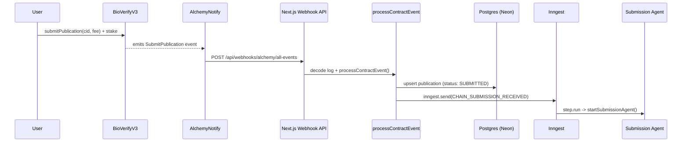
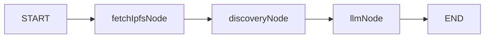
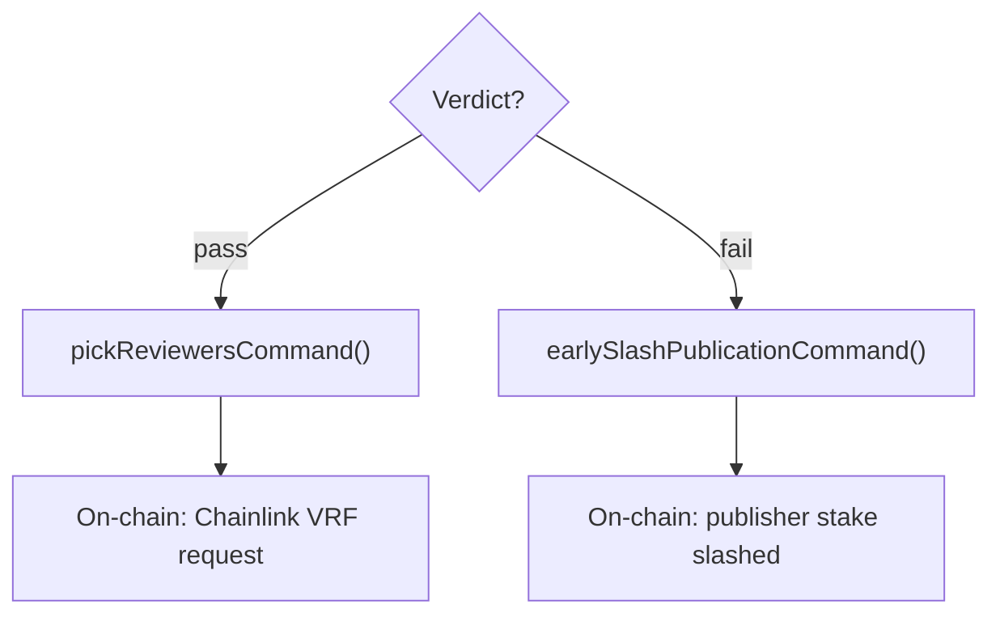

# Submission Agent

LangGraph agent that autonomously pre-validates scientific submissions for originality before they enter the peer-review pool. Acts as a "Proof of Originality" filter.

## Trigger Chain

A user calls `submitPublication(cid, fee)` on the `BioVerifyV3` smart contract, which emits a `SubmitPublication` event. That event flows through the infrastructure pipeline into this agent:

1. **Alchemy Notify** watches the `BioVerifyV3` contract and POSTs raw logs to the Next.js webhook at `apps/fe/app/api/webhooks/alchemy/all-events/route.ts`.
2. The webhook decodes each log with `viem` and calls `processContractEvent()` from `@packages/cqrs`, which upserts the publication into Postgres and emits an Inngest event.
3. The Inngest function `audit-publication-submission` picks up `CHAIN_SUBMISSION_RECEIVED` and runs `startSubmissionAgent()` inside a durable `step.run`.

## Graph

Linear pipeline -- no conditional edges inside the graph itself.

### Nodes

| Node | What it does |
|------|-------------|
| `fetchIpfsNode` | Resolves the IPFS manifest from `rootCid`, fetches the abstract text. |
| `discoveryNode` | Neural search via **Exa AI** for prior publications that could indicate plagiarism or lack of novelty. Returns up to 5 scored sources. |
| `llmNode` | Gemini (`gemini-2.5-flash-lite`) with structured output. Produces `{ decision: "pass" \| "fail", reason }`. |

### State

| Field | Type | Default |
|-------|------|---------|
| `publicationId` | `string` | -- |
| `rootCid` | `string` | -- |
| `publication` | `{ abstract }` | -- |
| `sources` | `any[]` | `[]` |
| `verdict` | `{ decision, reason }` | `{ decision: "pending" }` |

## Post-Graph Settlement

After the graph completes, `agent-start.ts` reads the verdict and branches:

- **Pass**: calls `pickReviewersCommand()`, which triggers a Chainlink VRF request on-chain to randomly select peer reviewers. This is the entry point for the [Review Agent](../review/README.md).
- **Fail**: calls `earlySlashPublicationCommand()`, which pins the reason to IPFS and immediately slashes the publisher's stake on-chain.

## State Persistence

The graph is compiled with a **Postgres checkpointer** (`PostgresSaver` from `@langchain/langgraph-checkpoint-postgres`) connected to a **Neon** database via `NEON_AGENTS_DATABASE_URL`. Each invocation is keyed by `thread_id = getThreadId({ type: SUBMISSION, publicationId, rootCid })`.

## Durable Execution

**Inngest** wraps the agent invocation in a durable `step.run` with 3 retries. On completion, the Inngest function emits `SUBMISSION_AGENT_AUDIT_COMPLETED` for downstream hooks. Inngest functions are registered and served from `apps/fe/app/api/inngest/route.ts`.

## Notifications

Telegram alerts are sent on agent start and on verdict (pass or fail), including links to the IPFS manifest.
