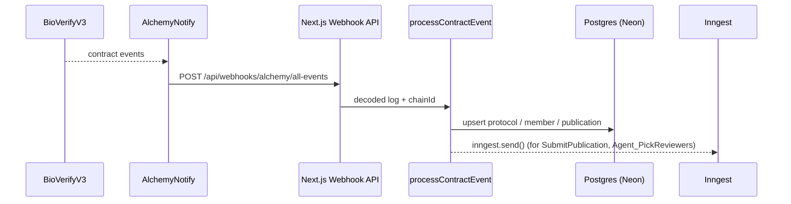

# @packages/cqrs

Command Query Responsibility Segregation package for BioVerify. Commands write to the blockchain and IPFS; a sync layer projects on-chain events into a Postgres read model; queries read from that projection.

## Structure

```
src/
├── commands/
│   ├── actions/
│   │   ├── submission/
│   │   │   ├── early-slash-publication.ts
│   │   │   └── pick-reviewers.ts
│   │   └── review/
│   │       ├── publish-publication.ts
│   │       ├── record-review.ts
│   │       └── slash-publication.ts
│   └── sync/
│       └── events.ts              # on-chain event projector
└── queries/
    ├── publications.ts            # paginated list with filters
    ├── publication-by-id.ts
    ├── member-assignments.ts      # reviewer's assigned publications
    ├── members.ts
    ├── member-by-chain.ts
    ├── members-by-ids.ts
    ├── protocols.ts
    ├── protocol-by-chain.ts
    ├── stats-by-chain.ts
    └── stats-global.ts
```

## Event Sync (DB Projection)

`processContractEvent()` in `sync/events.ts` is the core projector. It is called by the Alchemy Notify webhook route at `apps/fe/app/api/webhooks/alchemy/all-events/route.ts`, which decodes raw contract logs with `viem` and forwards them here.



### What it projects

The projector handles every event emitted by `BioVerifyV3` and upserts into three Drizzle ORM tables:

| DB Table | Events handled |
|----------|---------------|
| `protocolDbSchema` | `RewardPool`, `SlashPool`, `Agent_MoveSlashPoolToRewardPool`, `Agent_TransferSlashPoolToTreasury` |
| `memberDbSchema` | `MemberAvailableStake`, `MemberLockedStake`, `MemberReputation`, `IsAvailableReviewer`, `RewardMember`, `SlashMember` |
| `publicationDbSchema` | `SubmitPublication`, `LockedStakeOnPubId`, `NewPublicationStatus`, `Agent_PickReviewers`, `Agent_RecordReview`, `Agent_FinalizePublication` |

### Optimistic Concurrency Control

Alchemy webhooks can arrive out of order. Every upsert includes a `versionCheck` guard that compares `(blockNumber, logIndex)` against the stored values -- an update is only applied if the incoming event is strictly newer. This prevents stale webhooks from overwriting fresher state.

### Agent Triggers

Two events also emit Inngest events to kick off the AI agents:

| Contract Event | Inngest Event | Agent Started |
|---------------|---------------|---------------|
| `SubmitPublication` | `CHAIN_SUBMISSION_RECEIVED` | [Submission Agent](../../agents/graphs/submission/README.md) |
| `Agent_PickReviewers` | `CHAIN_PICKED_REVIEWERS_RECEIVED` | [Review Agent](../../agents/graphs/review/README.md) |

## Queries (Read Model)

All queries read from the projected Postgres tables via Drizzle ORM. They power the frontend UI and API.

| Query | Description |
|-------|-------------|
| `getPublications` | Paginated publication list with optional chain/status filters. |
| `getPublicationById` | Single publication by composite ID (`chainId-pubId`). |
| `getMemberAssignments` | Publications assigned to a reviewer (status `IN_REVIEW`). |
| `getMembers` | All registered members. |
| `getMemberByChain` | Single member by address + chain. |
| `getMembersByIds` | Batch member lookup by composite IDs. |
| `getProtocols` | All protocol configs across chains. |
| `getProtocolByChain` | Protocol config for a specific chain. |
| `getStatsByChain` | Per-chain stats: reward pool, reviewer pool size, liquidity checks. |
| `getStatsGlobal` | Aggregated stats across all chains: pools, member count, publication count. |

## Action Commands

Each command wraps a `viem` contract interaction (`simulateContract` + `writeContract`) signed by the agent wallet. Some also pin data to IPFS and send Telegram notifications.

| Command | Contract Function | Extras |
|---------|-------------------|--------|
| `pickReviewersCommand` | `pickReviewers(pubId)` | Telegram notification |
| `earlySlashPublicationCommand` | `earlySlashPublication(pubId, verdictCid)` | IPFS pin (reason) + Telegram |
| `recordReviewCommand` | `recordReview(pubId, reviewer)` | -- |
| `publishPublicationCommand` | `publishPublication(pubId, honest, negligent, verdictCid)` | IPFS pin (verdict) + Telegram |
| `slashPublicationCommand` | `slashPublication(pubId, honest, negligent, verdictCid)` | IPFS pin (verdict) + Telegram |

## Dependencies

| Package | Role |
|---------|------|
| `@packages/db` | Drizzle database client |
| `@packages/schema` | DB schemas, domain types, mappers, Inngest event types |
| `@packages/env` | Environment variable access |
| `drizzle-orm` | Query builder |
| `viem` | EVM contract interaction + ABI decoding |
