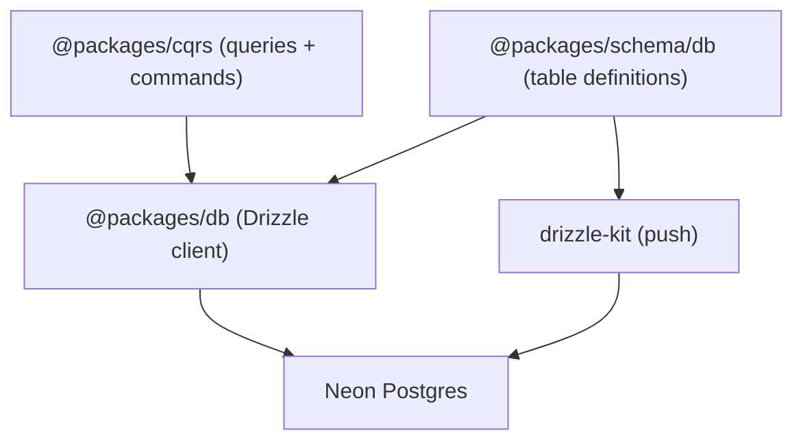

# @packages/db

Drizzle ORM client for BioVerify's Neon Postgres read model. This is a thin, server-only layer that exports a single typed `db` instance. Table definitions live in [`@packages/schema/db`](../schema/db/index.ts), and all queries and commands live in [`@packages/cqrs`](../cqrs/README.md).

## How It Fits

## Connection

The client uses Neon's serverless HTTP driver (`@neondatabase/serverless` + `drizzle-orm/neon-http`). A `globalThis` singleton in development survives HMR without creating duplicate connections. The `server-only` import guard prevents accidental client-side bundling.

Requires `NEON_DATABASE_URL` (validated via `@packages/env`).

> **Note:** `NEON_AGENTS_DATABASE_URL` (used by the LangGraph checkpointer in `@packages/agents`) is a separate database and is not managed by this package.

## Schema

Table definitions are in `@packages/schema/db`. They mirror the on-chain structs from [`BioVerifyV3`](../../apps/contracts/README.md) and are populated by the event projector in [`@packages/cqrs`](../cqrs/README.md).

| Table | PK format | Description |
|-------|-----------|-------------|
| `member` | `chainId-address` | Reviewer pool members: stakes, reputation, availability, action counters. |
| `publication` | `chainId-pubId` | Publication lifecycle: publisher, CID, reviewers, status, verdict. |
| `protocol` | `chainId` | Per-chain protocol config (stakes, fees, rewards) and pool balances. |

All three tables share two column fragments:

- **`indexingMetadata`** (`lastBlockNumber`, `lastLogIndex`) -- Optimistic Concurrency Control. Ensures out-of-order Alchemy webhooks never overwrite newer data.
- **`timestamps`** (`createdAt`, `updatedAt`) -- auto-managed by Drizzle (`$onUpdate`).

## Schema Sync

The project uses **push-based** schema sync (no versioned migration files). `drizzle.config.ts` points at the `@packages/schema/db` table definitions and the `NEON_DATABASE_URL` connection.

## Seed Script

`scripts/seed-protocol.ts` upserts `protocol` rows for **Base Sepolia** and **Eth Sepolia** with contract constants from environment variables. The upsert is idempotent (`onConflictDoUpdate` on the primary key).

## Scripts

| Script | Command | Description |
|--------|---------|-------------|
| `db:push` | `drizzle-kit push` | Push the Drizzle schema to Neon (destructive sync). |
| `db:seed` | `tsx --conditions=react-server ./scripts/seed-protocol.ts` | Seed protocol rows for all supported chains. |

Both are also available from the **monorepo root** via `pnpm db:push` and `pnpm db:seed`.

## Environment Variables

| Variable | Used by | Description |
|----------|---------|-------------|
| `NEON_DATABASE_URL` | Client + drizzle-kit | Neon Postgres connection string. |
| `AI_AGENT_ADDRESS` | Seed only | Agent wallet address. |
| `TREASURY_ADDRESS` | Seed only | Treasury wallet address. |
| `VRF_NUM_WORDS` | Seed only | Number of random words per VRF request. |
| `DEPLOY_VALUE` | Seed only | Initial reward pool balance. |
| `REPUTATION_BOOST` | Seed only | Reputation delta per settlement. |
| `PUBLISHER_MIN_FEE` | Seed only | Minimum publisher submission fee. |
| `PUBLISHER_STAKE` | Seed only | Required publisher stake. |
| `REVIEWER_STAKE` | Seed only | Required reviewer stake. |
| `REVIEWER_REWARD` | Seed only | Per-review reward amount. |

## Dependencies

| Package | Role |
|---------|------|
| `@neondatabase/serverless` | Neon HTTP connection driver |
| `drizzle-orm` | ORM and query builder |
| `drizzle-kit` | Schema push tooling |
| `server-only` | Prevents client-side import |
| `@packages/env` | Type-safe environment variable access |
| `@packages/schema` | Drizzle table definitions and domain types |
